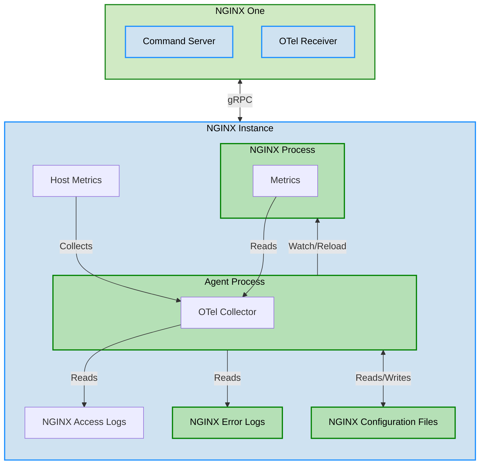


NGINX Agent v3.0 is a major release that introduces new features and enhancements.

Visit our [Update]() guide to install the latest version in your environment.


F5 NGINX Agent is a lightweight companion daemon designed to work with NGINX One and enable remote management of NGINX instances. It also gathers performance metrics from NGINX and transmits them to the NGINX One Console for enhanced monitoring and control.

## Key features

Enable Access to key NGINX One use cases:

   - Seamlessly integrates with essential NGINX One functionality, simplifying access to its core use cases and
     enhancing operational workflows.
   - [Connects NGINX instances to NGINX One Console]()

Real-time observability into NGINX One data plane instances:

   - Provides live monitoring and actionable insights into the performance, status, and health of NGINX One data plane
     instances,  improving decision-making and operational efficiency.
   - NGINX Agent supports [OpenTelemetry](https://opentelemetry.io/), and the ability to
     [export the metrics data]() for use in other applications.

### Configuration management

- NGINX Agent provides an interface that enables users to deploy configuration changes to NGINX instances from a
  centralized management plane.
- Additionally, NGINX Agent verifies that the configuration changes are successfully applied to NGINX instances.

### Metrics collection

NGINX Agent comes pre-packaged with an embedded OpenTelemetry Collector. This embedded collector gathers vital performance
and health metrics for both NGINX and the underlying instance it operates on.

For example, it tracks key metrics such as active connections, requests per second, HTTP status codes, and response times.
Additionally, it collects system-level data, including CPU usage, memory consumption, and disk I/O. These insights provide
deep observability into NGINX's behavior, enabling teams to troubleshoot issues effectively, optimize performance, and
maintain high availability.

Collected metrics can be seamlessly exported to NGINX One Console or integrated with third-party data aggregators.

## Architecture

The figure shows:

- An NGINX instance running on bare metal, virtual machine or container
- NGINX One Cloud Console includes:

  - Command Server to manage NGINX configurations, push new/updated configuration files remotely, and perform integrity tests.
  - OpenTelemetry (OTel) Receiver that receives observability data from connected Agent instances.

- An NGINX Agent process running on the NGINX instance. NGINX Agent is responsible for:

  - Watching, applying, validating, automatically roll back to last good configuration if issues are detected.
  - Embedding an OpenTelemetry Collector, collecting metrics from NGINX processes, host system performance data,  then securely passing metric data to NGINX One Cloud Console.

- Collection and monitoring of host metrics (CPU usage, Memory utilization, Disk I/O) by the Agent OTel collector.
- Collected data is made available on NGINX One Cloud Console for monitoring, alerting, troubleshooting, and capacity planning purposes.
