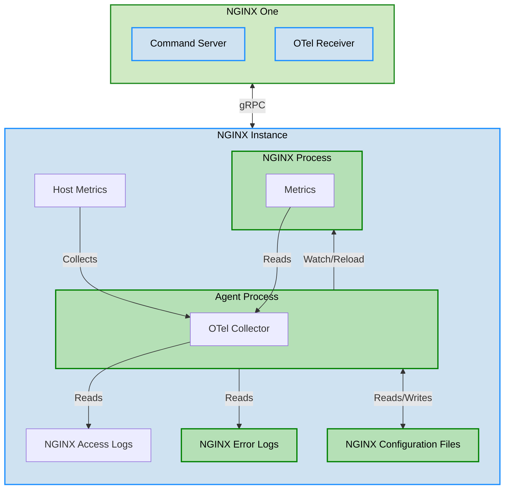

---
docs:
files:
   - content/agent/about.md
   - content/nginx-one/agent/about.md
---

The figure shows:

- An NGINX instance running on bare metal, virtual machine or container
- NGINX One Cloud Console includes:

  - Command Server to manage NGINX configurations, push new/updated configuration files remotely, and perform integrity tests.
  - OpenTelemetry (OTel) Receiver that receives observability data from connected Agent instances.

- An NGINX Agent process running on the NGINX instance. NGINX Agent is responsible for:

  - Watching, applying, validating, automatically roll back to last good configuration if issues are detected.
  - Embedding an OpenTelemetry Collector, collecting metrics from NGINX processes, host system performance data,  then securely passing metric data to NGINX One Cloud Console.

- Collection and monitoring of host metrics (CPU usage, Memory utilization, Disk I/O) by the Agent OTel collector.
- Collected data is made available on NGINX One Cloud Console for monitoring, alerting, troubleshooting, and capacity planning purposes.
