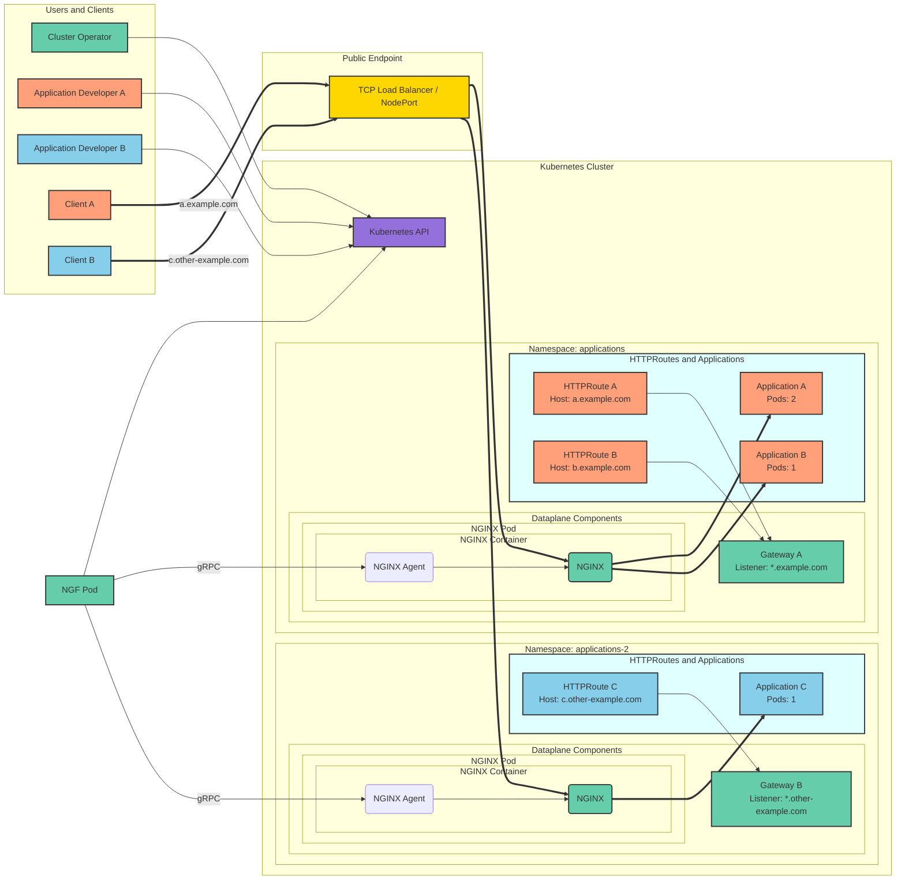
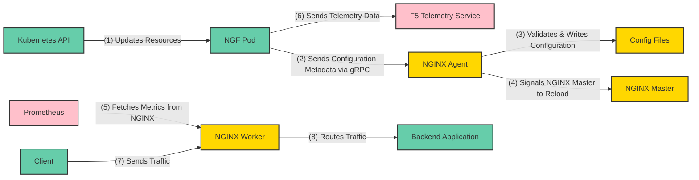

Learn about the architecture and design principles of NGINX Gateway Fabric: a Kubernetes Gateway API implementation which uses NGINX as the data plane. 

This document is intended for:

- _Cluster Operators_ who want to understand how NGINX Gateway Fabric works in production, how it manages traffic, and how to troubleshoot failures.

- _Application Developers_ who would like to use NGINX Gateway Fabric to expose and route traffic to their applications within Kubernetes.

The reader needs to be familiar with core Kubernetes concepts, such as pods, deployments, services, and endpoints. For an understanding of how NGINX itself works, you can read the ["Inside NGINX: How We Designed for Performance & Scale"](https://www.nginx.com/blog/inside-nginx-how-we-designed-for-performance-scale/) blog post.

If you are interested in contributing to the project or learning about its internal implementation details, please see the [Developer Architecture Guide](https://github.com/nginx/nginx-gateway-fabric/tree/main/docs/architecture).

---

## NGINX Gateway Fabric Deployment Model and Architectural Overview

NGINX Gateway Fabric splits its architecture into two main parts to provide better security, flexibility, and reliability:

### Control Plane: Centralized Management

The control plane operates as a Deployment, serving as a [Kubernetes controller](https://kubernetes.io/docs/concepts/architecture/controller/) built with the [controller-runtime](https://github.com/kubernetes-sigs/controller-runtime) library. It manages all aspects of resource provisioning and configuration for the NGINX data planes by watching Gateway API resources and other Kubernetes objects such as Services, Endpoints, and Secrets.

Key functionalities include:

- Dynamic provisioning: When a new Gateway resource is created, the control plane automatically provisions a dedicated NGINX Deployment and exposes it using a Service.
- Configuration management: Kubernetes and Gateway API resources are translated into NGINX configurations, which are securely delivered to the data plane pods via a gRPC connection to the NGINX Agent.
- Secure communication: By default, the gRPC connection uses self-signed certificates generated during installation. Integration with [cert-manager](https://cert-manager.io/) is also supported for optional certificate management.

### Data Plane: Autonomous Traffic Management

Each NGINX data plane pod can be provisioned as an independent Deployment or DaemonSet containing an `nginx` container. This container runs both the `nginx` process and the [NGINX agent](https://github.com/nginx/agent), which is responsible for:

- Applying configurations: The agent receives updates from the control plane and applies them to the NGINX instance.
- Handling reloads: NGINX Agent handles configuration reconciliation and reloading NGINX, eliminating the need for shared volumes or Unix signals between the control plane and data plane pods.

### Gateway Resource Management

Users can have multiple gateways running side-by-side in the same cluster. This supports flexible operation and isolation across Gateways:

- Concurrent Gateways: Multiple Gateway objects can run simultaneously within a single installation.
- 1:1 resource mapping: Each Gateway resource corresponds uniquely to a dedicated data plane deployment, ensuring clear delineation of ownership and operational segregation.

---

## High-level overview of NGINX Gateway Fabric in execution

This figure depicts an example of NGINX Gateway Fabric exposing three web applications within a Kubernetes cluster to clients on the internet:

 The figure does not show many of the necessary Kubernetes resources the Cluster Operators and Application Developers need to create, like deployment and services. 

The figure shows:



| **Category**           | **Description**                                                                                                                                       |
|-------------------------|-------------------------------------------------------------------------------------------------------------------------------------------------------|
| **Namespaces**          | - _Namespace: applications_: Contains Gateway A for `*.example.com`, handling Application A and Application B. - _Namespace: applications-2_: Contains Gateway B for `*.other-example.com`, handling Application C.    |
| **Users**               | - _Cluster Operator_: Sets up NGF and manages Gateway API resources by provisioning Gateways (A and B) and the NGF Pod. - _Developers A & B_: Developers deploy their applications and create HTTPRoutes. |
| **Clients**             | - _Client A_: Interacts with Application A through `a.example.com`. - _Client B_: Interacts with Application C through `c.other-example.com`.     |
| **NGF Pod**             | The control plane component, deployed in `nginx-gateway`, communicates with the Kubernetes API to: - Fetch Gateway API resources. - Dynamically manage NGINX data plane deployments. |
| **Gateways**            | - _Gateway A_: Listens for requests under `*.example.com`. Routes: &nbsp;&nbsp;&nbsp;• _HTTPRoute A_: Routes `a.example.com` to Application A. &nbsp;&nbsp;&nbsp;• _HTTPRoute B_: Routes `b.example.com` to Application B. - _Gateway B_: Listens for requests under `*.other-example.com`. Routes: &nbsp;&nbsp;&nbsp;• _HTTPRoute C_: Routes `c.other-example.com` to Application C. |
| **Applications**        | - _Application A_: Deployed by Developer A (2 pods) and routed to by Gateway A. - _Application B_: Deployed by Developer A (1 pod) and routed to by Gateway A. - _Application C_: Deployed by Developer B (1 pod) and routed to by Gateway B. |
| **NGINX Pods**          | - _NGINX Pod A_: Handles traffic from Gateway A: &nbsp;&nbsp;&nbsp;• _NGINX Process A_: Routes to Application A and Application B. &nbsp;&nbsp;&nbsp;• _NGINX Agent A_: Updates configuration via gRPC. - _NGINX Pod B_: Handles traffic from Gateway B: &nbsp;&nbsp;&nbsp;• _NGINX Process B_: Routes to Application C. &nbsp;&nbsp;&nbsp;• _NGINX Agent B_: Updates configuration via gRPC. |
| **Traffic Flow**        | - _Client A_: &nbsp;&nbsp;&nbsp;1. Sends requests to `a.example.com` via Public Endpoint. &nbsp;&nbsp;&nbsp;2. Routed to Application A by NGINX Process A. - _Client B_: &nbsp;&nbsp;&nbsp;1. Sends requests to `c.other-example.com` via Public Endpoint. &nbsp;&nbsp;&nbsp;2. Routed to Application C by NGINX Process B. |
| **Public Endpoint**     | A shared entry point (TCP Load Balancer or NodePort) that exposes the NGINX Service externally and forwards client traffic into the cluster.                   |
| **Kubernetes API**      | Acts as the central hub for resource management: - Fetches Gateway API resources. - Updates NGINX configuration dynamically via the NGF Pod.    |

{}

_Color Coding_ :
  - Cluster Operator resources (e.g., NGINX Gateway Fabric, NGINX Pods and Gateways) are marked in _green_.
  - Resources owned by _Application Developer A_ (e.g., HTTPRoute A, Application A) are marked in _orange_.
  - Resources owned by _Application Developer B_ (e.g., HTTPRoute B, Application C) are marked in _blue_.

---

## NGINX Gateway Fabric: Component Communication Workflow

The following table describes the connections, preceeded by their types in parentheses. For brevity, the suffix "process" has been omitted from the process descriptions.


| #  | Component/Protocol      | Description                                                                                                  |
| ---| ----------------------- | ------------------------------------------------------------------------------------------------------------ |
| 1  | Kubernetes API (HTTPS) | _Kubernetes API → NGF Pod_: The NGF Pod watches the Kubernetes API for Gateway API resources (e.g., Gateways, HTTPRoutes) to fetch the latest cluster configuration. |
| 2  | gRPC                   | _NGF Pod → NGINX Agent_: The NGF Pod processes the Gateway API resources, generates NGINX configuration metadata, and sends it securely to the NGINX Agent over gRPC. |
| 3  | File I/O               | _NGINX Agent → Config Files_: The NGINX Agent validates the configuration and writes the configuration files. |
| 4  | Signal                 | _NGINX Agent → NGINX Master_: The NGINX Agent signals the NGINX Master process to reload the updated configuration. This ensures the updated routes and settings are live. |
| 5  | HTTP/HTTPS             | _Prometheus → NGINX Worker_: Prometheus collects runtime metrics (e.g., traffic stats, request details) directly from the NGINX Worker via the HTTP endpoint (`:9113/metrics`). This data helps monitor the operational state of the data plane. |
| 6  | HTTPS                  | _NGF Pod → F5 Telemetry Service_: The NGF Pod sends system and usage telemetry data (like API requests handled, error rates, and performance metrics) to the F5 Telemetry Service for analytics. |
| 7  | HTTP, HTTPS            | _Client → NGINX Worker_: Clients send traffic (e.g., HTTP/HTTPS requests) to the NGINX Worker. These are typically routed via a public LoadBalancer or NodePort to expose NGINX. |
{}

---

### NGINX Plus Features and Benefits

NGINX Gateway Fabric supports both NGINX Open Source and NGINX Plus. While the previous diagram shows NGINX Open Source, using NGINX Plus provides additional capabilities, including:

- The ability for administrators to connect to the NGINX Plus API on port 8765 (restricted to localhost by default).
- Dynamic updates to upstream servers without requiring a full reload:
  - Changes to upstream servers, such as application scaling (e.g., adding or removing pods in Kubernetes), can be applied using the [NGINX Plus API](http://nginx.org/en/docs/http/ngx_http_api_module.html).
  - This reduces the frequency of configuration reloads, minimizing potential disruptions and improving system stability during updates.

These features enable reduced downtime, improved performance during scaling events, and more fine-grained control over traffic management.

---

### Resilience and fault isolation

This architecture separates the control plane and data plane, creating clear operational boundaries that improve resilience and fault isolation. It also enhances scalability, security, and reliability while reducing the risk of failures affecting both components.

#### Control plane resilience

In the event of a control plane failure or downtime:
- Existing data plane pods continue serving traffic using their last-valid cached configurations.
- Updates to routes or Gateways are temporarily paused, but stable traffic delivery continues without degradation.
- Recovery restores functionality, resynchronizing configuration updates seamlessly.

#### Data plane resilience

If a data plane pod encounters an outage or restarts:
- Only routes tied to the specific linked Gateway object experience brief disruptions.
- Configurations automatically resynchronize with the data plane upon pod restart, minimizing the scope of impact.
- Other data plane pods remain unaffected and continue serving traffic normally.

---

## Pod readiness

The control plane (`nginx-gateway`) and data plane (`nginx`) containers provide a readiness endpoint at `/readyz`. A [readiness probe](https://kubernetes.io/docs/tasks/configure-pod-container/configure-liveness-readiness-startup-probes/#define-readiness-probes) periodically checks this endpoint during startup. The probe reports `200 OK` when:
- The control plane is ready to configure the NGINX data planes.
- The data plane is ready to handle traffic.

This marks the pods ready ensuring traffic is routed to healthy pods, ensuring reliable startup and smooth operations.
