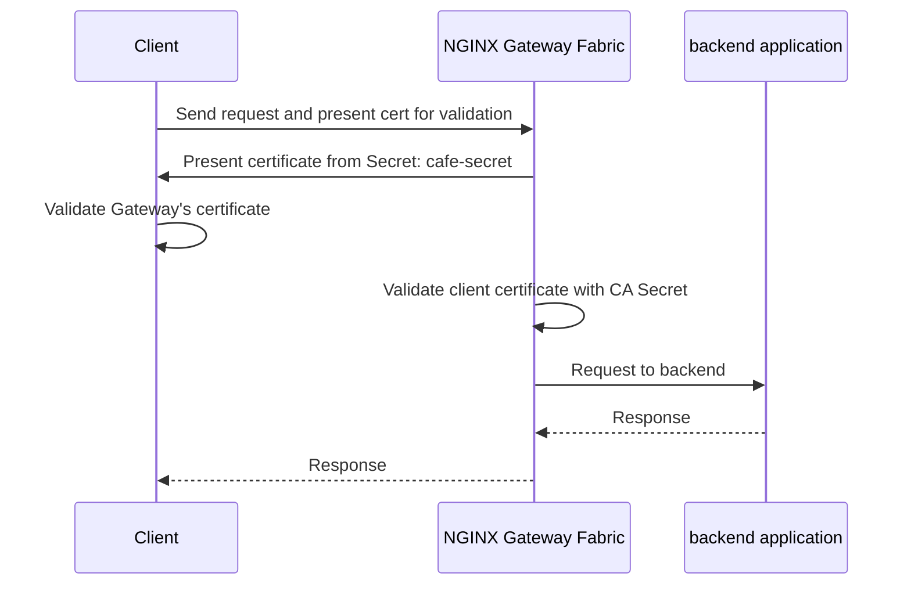

Learn how to validate client requests at the Gateway using Frontend TLS configuration in NGINX Gateway Fabric.

## Overview

In this guide, we will configure client to Gateway validation (mTLS) using the Gateway's Frontend TLS settings. This example shows how to validate client certificates at the Gateway, to ensure that communication between the client and the Gateway is secure, and that only authorized requests are processed and sent to the backend.

With Frontend TLS, the Gateway validates incoming client certificates against one or more CA certificates. You can configure validation at two levels:

- **Default**: Applies frontend validation to all HTTPS listeners on the Gateway.
- **Per-port**: Overrides the default frontend validation for specific listener ports.

Both **Default** and **Per-port** can be configured with one of two validation modes:

- **AllowValidOnly** (default): When set, a valid client certificate must be presented. Connections without a valid certificate are rejected.
- **AllowInsecureFallback**: When set, all connections with either a valid or invalid certificate are allowed, as well as no certificate.

CA certificates can be stored in either a `Secret` or a `ConfigMap`, and must contain the `ca.crt` key.

The following diagram shows how the mTLS handshake takes place between the client, and NGINX Gateway Fabric:



## Before you begin

Before starting, you will need:

- Administrator access to a Kubernetes cluster.
- [Helm](https://helm.sh/) and [kubectl](https://kubernetes.io/docs/tasks/tools/#kubectl) must be installed locally.
- [NGINX Gateway Fabric deployed]() in the Kubernetes cluster.

## Install Gateway API CRDs

```shell
kubectl kustomize "https://github.com/nginx/nginx-gateway-fabric/config/crd/gateway-api/standard?ref=v2.6.0" | kubectl apply -f -
```

## Install cert-manager

Frontend TLS requires CA certificates for client certificate validation. In this example, we will use [cert-manager](https://cert-manager.io/) to issue these certificates.

Add the Helm repository:

```shell
helm repo add jetstack https://charts.jetstack.io
helm repo update
```

Install cert-manager:

```shell
helm install \
  cert-manager jetstack/cert-manager \
  --namespace cert-manager \
  --create-namespace \
  --set config.apiVersion="controller.config.cert-manager.io/v1alpha1" \
  --set config.kind="ControllerConfiguration" \
  --set config.enableGatewayAPI=true \
  --set crds.enabled=true
```

## Create a CA Issuer

Create a CA issuer to generate our certificates.

 This example uses a `selfSigned` Issuer, which should not be used in production environments. For production environments, use a real [CA issuer](https://cert-manager.io/docs/configuration/ca/). 

Next, we create the following resources:
1. A self-signed issuer
2. A CA certificate named `default-validation-ca-secret` for our **default** frontend TLS validation
3. A CA certificate named `per-port-validation-ca-secret` for our **perPort** frontend TLS validation

```yaml
kubectl apply -f - <<EOF
apiVersion: cert-manager.io/v1
kind: Issuer
metadata:
  name: selfsigned-issuer
spec:
  selfSigned: {}
---
apiVersion: cert-manager.io/v1
kind: Certificate
metadata:
  name: local-ca-default
spec:
  isCA: true
  commonName: LocalCA
  secretName: default-validation-ca-secret
  issuerRef:
    name: selfsigned-issuer
    kind: Issuer
    group: cert-manager.io
---
apiVersion: cert-manager.io/v1
kind: Issuer
metadata:
  name: default-validation-issuer
spec:
  ca:
    secretName: default-validation-ca-secret # CA cert for default validation
---
apiVersion: cert-manager.io/v1
kind: Certificate
metadata:
  name: local-ca-per-port
spec:
  isCA: true
  commonName: LocalCA
  secretName: per-port-validation-ca-secret
  issuerRef:
    name: selfsigned-issuer
    kind: Issuer
    group: cert-manager.io
---
apiVersion: cert-manager.io/v1
kind: Issuer
metadata:
  name: per-port-validation-issuer
spec:
  ca:
    secretName: per-port-validation-ca-secret # CA cert for perPort validation
EOF
```

## Deploy example applications

Create the coffee and tea applications that will serve as backends.
Copy and paste the following block into your terminal:

```yaml
kubectl apply -f - <<EOF
apiVersion: apps/v1
kind: Deployment
metadata:
  name: coffee
spec:
  replicas: 1
  selector:
    matchLabels:
      app: coffee
  template:
    metadata:
      labels:
        app: coffee
    spec:
      containers:
      - name: coffee
        image: nginxdemos/nginx-hello:plain-text
        ports:
        - containerPort: 8080
---
apiVersion: v1
kind: Service
metadata:
  name: coffee
spec:
  ports:
  - port: 80
    targetPort: 8080
    protocol: TCP
    name: http
  selector:
    app: coffee
---
apiVersion: apps/v1
kind: Deployment
metadata:
  name: tea
spec:
  replicas: 1
  selector:
    matchLabels:
      app: tea
  template:
    metadata:
      labels:
        app: tea
    spec:
      containers:
      - name: tea
        image: nginxdemos/nginx-hello:plain-text
        ports:
        - containerPort: 8080
---
apiVersion: v1
kind: Service
metadata:
  name: tea
spec:
  ports:
  - port: 80
    targetPort: 8080
    protocol: TCP
    name: http
  selector:
    app: tea
EOF
```

Verify the pods are running:

```shell
kubectl get pods
```

```text
NAME                       READY   STATUS    RESTARTS   AGE
coffee-6b8b6d6486-7fc78    1/1     Running   0          9s
tea-6fb46d899f-qlmz9       1/1     Running   0          9s
```

## Create TLS certificate and CA certificate resources

Create the TLS certificate and a Secret containing the server certificate that the Gateway will present to clients:

```yaml
kubectl apply -f - <<EOF
apiVersion: v1
kind: Secret
metadata:
  name: cafe-secret
type: kubernetes.io/tls
data:
  tls.crt: LS0tLS1CRUdJTiBDRVJUSUZJQ0FURS0tLS0tCk1JSUNzakNDQVpvQ0NRQzdCdVdXdWRtRkNEQU5CZ2txaGtpRzl3MEJBUXNGQURBYk1Sa3dGd1lEVlFRRERCQmoKWVdabExtVjRZVzF3YkdVdVkyOXRNQjRYRFRJeU1EY3hOREl4TlRJek9Wb1hEVEl6TURjeE5ESXhOVEl6T1ZvdwpHekVaTUJjR0ExVUVBd3dRWTJGbVpTNWxlR0Z0Y0d4bExtTnZiVENDQVNJd0RRWUpLb1pJaHZjTkFRRUJCUUFECmdnRVBBRENDQVFvQ2dnRUJBTHFZMnRHNFc5aStFYzJhdnV4Q2prb2tnUUx1ek10U1Rnc1RNaEhuK3ZRUmxIam8KVzFLRnMvQVdlS25UUStyTWVKVWNseis4M3QwRGtyRThwUisxR2NKSE50WlNMb0NEYUlRN0Nhck5nY1daS0o4Qgo1WDNnVS9YeVJHZjI2c1REd2xzU3NkSEQ1U2U3K2Vab3NPcTdHTVF3K25HR2NVZ0VtL1Q1UEMvY05PWE0zZWxGClRPL051MStoMzROVG9BbDNQdTF2QlpMcDNQVERtQ0thaEROV0NWbUJQUWpNNFI4VERsbFhhMHQ5Z1o1MTRSRzUKWHlZWTNtdzZpUzIrR1dYVXllMjFuWVV4UEhZbDV4RHY0c0FXaGRXbElweHlZQlNCRURjczN6QlI2bFF1OWkxZAp0R1k4dGJ3blVmcUVUR3NZdWxzc05qcU95V1VEcFdJelhibHhJZVVDQXdFQUFUQU5CZ2txaGtpRzl3MEJBUXNGCkFBT0NBUUVBcjkrZWJ0U1dzSnhLTGtLZlRkek1ISFhOd2Y5ZXFVbHNtTXZmMGdBdWVKTUpUR215dG1iWjlpbXQKL2RnWlpYVE9hTElHUG9oZ3BpS0l5eVVRZVdGQ2F0NHRxWkNPVWRhbUloOGk0Q1h6QVJYVHNvcUNOenNNLzZMRQphM25XbFZyS2lmZHYrWkxyRi8vblc0VVNvOEoxaCtQeDljY0tpRDZZU0RVUERDRGh1RUtFWXcvbHpoUDJVOXNmCnl6cEJKVGQ4enFyM3paTjNGWWlITmgzYlRhQS82di9jU2lyamNTK1EwQXg4RWpzQzYxRjRVMTc4QzdWNWRCKzQKcmtPTy9QNlA0UFlWNTRZZHMvRjE2WkZJTHFBNENCYnExRExuYWRxamxyN3NPbzl2ZzNnWFNMYXBVVkdtZ2todAp6VlZPWG1mU0Z4OS90MDBHUi95bUdPbERJbWlXMGc9PQotLS0tLUVORCBDRVJUSUZJQ0FURS0tLS0tCg==
  tls.key: LS0tLS1CRUdJTiBQUklWQVRFIEtFWS0tLS0tCk1JSUV2UUlCQURBTkJna3Foa2lHOXcwQkFRRUZBQVNDQktjd2dnU2pBZ0VBQW9JQkFRQzZtTnJSdUZ2WXZoSE4KbXI3c1FvNUtKSUVDN3N6TFVrNExFeklSNS9yMEVaUjQ2RnRTaGJQd0ZuaXAwMFBxekhpVkhKYy92TjdkQTVLeApQS1VmdFJuQ1J6YldVaTZBZzJpRU93bXF6WUhGbVNpZkFlVjk0RlAxOGtSbjl1ckV3OEpiRXJIUncrVW51L25tCmFMRHF1eGpFTVBweGhuRklCSnYwK1R3djNEVGx6TjNwUlV6dnpidGZvZCtEVTZBSmR6N3Rid1dTNmR6MHc1Z2kKbW9RelZnbFpnVDBJek9FZkV3NVpWMnRMZllHZWRlRVJ1VjhtR041c09va3R2aGxsMU1udHRaMkZNVHgySmVjUQo3K0xBRm9YVnBTS2NjbUFVZ1JBM0xOOHdVZXBVTHZZdFhiUm1QTFc4SjFINmhFeHJHTHBiTERZNmpzbGxBNlZpCk0xMjVjU0hsQWdNQkFBRUNnZ0VBQnpaRE50bmVTdWxGdk9HZlFYaHRFWGFKdWZoSzJBenRVVVpEcUNlRUxvekQKWlV6dHdxbkNRNlJLczUyandWNTN4cU9kUU94bTNMbjNvSHdNa2NZcEliWW82MjJ2dUczYnkwaVEzaFlsVHVMVgpqQmZCcS9UUXFlL2NMdngvSkczQWhFNmJxdFRjZFlXeGFmTmY2eUtpR1dzZk11WVVXTWs4MGVJVUxuRmZaZ1pOCklYNTlSOHlqdE9CVm9Sa3hjYTVoMW1ZTDFsSlJNM3ZqVHNHTHFybmpOTjNBdWZ3ZGRpK1VDbGZVL2l0K1EvZkUKV216aFFoTlRpNVFkRWJLVStOTnYvNnYvb2JvandNb25HVVBCdEFTUE05cmxFemIralQ1WHdWQjgvLzRGY3VoSwoyVzNpcjhtNHVlQ1JHSVlrbGxlLzhuQmZ0eVhiVkNocVRyZFBlaGlPM1FLQmdRRGlrR3JTOTc3cjg3Y1JPOCtQClpoeXltNXo4NVIzTHVVbFNTazJiOTI1QlhvakpZL2RRZDVTdFVsSWE4OUZKZnNWc1JRcEhHaTFCYzBMaTY1YjIKazR0cE5xcVFoUmZ1UVh0UG9GYXRuQzlPRnJVTXJXbDVJN0ZFejZnNkNQMVBXMEg5d2hPemFKZUdpZVpNYjlYTQoybDdSSFZOcC9jTDlYbmhNMnN0Q1lua2Iwd0tCZ1FEUzF4K0crakEyUVNtRVFWNXA1RnRONGcyamsyZEFjMEhNClRIQ2tTazFDRjhkR0Z2UWtsWm5ZbUt0dXFYeXNtekJGcnZKdmt2eUhqbUNYYTducXlpajBEdDZtODViN3BGcVAKQWxtajdtbXI3Z1pUeG1ZMXBhRWFLMXY4SDNINGtRNVl3MWdrTWRybVJHcVAvaTBGaDVpaGtSZS9DOUtGTFVkSQpDcnJjTzhkUVp3S0JnSHA1MzRXVWNCMVZibzFlYStIMUxXWlFRUmxsTWlwRFM2TzBqeWZWSmtFb1BZSEJESnp2ClIrdzZLREJ4eFoyWmJsZ05LblV0YlhHSVFZd3lGelhNcFB5SGxNVHpiZkJhYmJLcDFyR2JVT2RCMXpXM09PRkgKcmppb21TUm1YNmxhaDk0SjRHU0lFZ0drNGw1SHhxZ3JGRDZ2UDd4NGRjUktJWFpLZ0w2dVJSSUpBb0dCQU1CVApaL2p5WStRNTBLdEtEZHUrYU9ORW4zaGxUN3hrNXRKN3NBek5rbWdGMU10RXlQUk9Xd1pQVGFJbWpRbk9qbHdpCldCZ2JGcXg0M2ZlQ1Z4ZXJ6V3ZEM0txaWJVbWpCTkNMTGtYeGh3ZEVteFQwVit2NzZGYzgwaTNNYVdSNnZZR08KditwVVovL0F6UXdJcWZ6dlVmV2ZxdStrMHlhVXhQOGNlcFBIRyt0bEFvR0FmQUtVVWhqeFU0Ym5vVzVwVUhKegpwWWZXZXZ5TW54NWZyT2VsSmRmNzlvNGMvMHhVSjh1eFBFWDFkRmNrZW96dHNpaVFTNkN6MENRY09XVWxtSkRwCnVrdERvVzM3VmNSQU1BVjY3NlgxQVZlM0UwNm5aL2g2Tkd4Z28rT042Q3pwL0lkMkJPUm9IMFAxa2RjY1NLT3kKMUtFZlNnb1B0c1N1eEpBZXdUZmxDMXc9Ci0tLS0tRU5EIFBSSVZBVEUgS0VZLS0tLS0K
EOF
```

 This example TLS certificate can be issued and managed by [cert-manager](https://cert-manager.io/) as well. See our [integration with cert-manager]() page to learn more. 


## Configure the Gateway with Frontend TLS


Create a Gateway resource with HTTPS listeners and Frontend TLS client certificate validation configured. This example shows:

- An HTTPS listener on port `443` with per-port client validation set to `AllowValidOnly`.
- An HTTPS listener on port `8443` with default client validation set to `AllowValidOnly` (default when omitted).

```yaml
kubectl apply -f - <<EOF
apiVersion: gateway.networking.k8s.io/v1
kind: Gateway
metadata:
  name: gateway
spec:
  gatewayClassName: nginx
  listeners:
  - name: https
    port: 443
    protocol: HTTPS
    tls:
      mode: Terminate
      certificateRefs:
      - kind: Secret
        name: cafe-secret
  - name: https-2
    port: 8443
    protocol: HTTPS
    tls:
      mode: Terminate
      certificateRefs:
      - kind: Secret
        name: cafe-secret
  tls:
    frontend:
      default: # Default applies to all other HTTPS listeners
        validation:
          caCertificateRefs:
          - kind: Secret
            group: ""
            name: default-validation-ca-secret
            namespace: default
      perPort:
      - port: 443 # perPort overrides default for this port
        tls:
          validation:
            caCertificateRefs:
            - group: ""
              kind: Secret
              name: per-port-validation-ca-secret
              namespace: default
            mode: AllowValidOnly
EOF
```

Key details:
- The `tls.frontend.default.validation` section defines the default client certificate validation. This applies to all HTTPS listeners unless overridden by a `perPort` configuration. This also references the Secret, `default-validation-ca-secret`, which we issued earlier.
- The `tls.frontend.perPort` section allows overriding the default validation for a specific listener port. In this example, port `443` is configured with `AllowValidOnly` mode, ensuring only valid client certificates are accepted. This also references the Secret, `per-port-validation-ca-secret`, which we issued earlier.
- The `caCertificateRefs` field references the CA certificate used to validate client certificates. This can be either a `Secret` or a `ConfigMap` with a `ca.crt` key.
- If `mode` is omitted, `AllowValidOnly` is applied by default.

Confirm the Gateway was created and is programmed:

```shell
kubectl describe gateways.gateway.networking.k8s.io gateway
```

You should see the Gateway status is `Accepted` and `Programmed`:

```text
Status:
  Addresses:
    Type:   IPAddress
    Value:  10.96.36.219
  Conditions:
    Type:   Accepted
    Status: True
    Type:   Programmed
    Status: True
```

You should also see that both Listeners on the Gateway are also `Accepted` and `Programmed`:

```text
  Listeners:
    Attached Routes:  0
    Conditions:
      Last Transition Time:  2026-05-05T07:38:57Z
      Message:               The Listener is programmed
      Observed Generation:   1
      Reason:                Programmed
      Status:                True
      Type:                  Programmed
      Last Transition Time:  2026-05-05T07:38:57Z
      Message:               The Listener is accepted
      Observed Generation:   1
      Reason:                Accepted
      Status:                True
      Type:                  Accepted
      Last Transition Time:  2026-05-05T07:38:57Z
      Message:               All references are resolved
      Observed Generation:   1
      Reason:                ResolvedRefs
      Status:                True
      Type:                  ResolvedRefs
      Last Transition Time:  2026-05-05T07:38:57Z
      Message:               No conflicts
      Observed Generation:   1
      Reason:                NoConflicts
      Status:                False
      Type:                  Conflicted
    Name:                    https
```

Save the public IP address and ports of the Gateway into shell variables.
In this example, we will want the port values for both frontend validation modes

```text
GW_IP=XXX.YYY.ZZZ.III
GW_DEFAULT=<port number>
GW_PER_PORT=<port number>
```

## Create HTTPRoutes

Copy the yaml below into your terminal to create HTTPRoutes to route traffic to the backend applications:

```yaml
kubectl apply -f - <<EOF
apiVersion: gateway.networking.k8s.io/v1
kind: HTTPRoute
metadata:
  name: tea
spec:
  parentRefs:
  - name: gateway
    sectionName: https # Uses port 443
  hostnames:
  - "cafe.example.com"
  rules:
  - matches:
    - path:
        type: PathPrefix
        value: /tea
    backendRefs:
    - name: tea
      port: 80
---
apiVersion: gateway.networking.k8s.io/v1
kind: HTTPRoute
metadata:
  name: coffee
spec:
  parentRefs:
  - name: gateway
    sectionName: https-2 # Uses port 8443
  hostnames:
  - "cafe.example.com"
  rules:
  - matches:
    - path:
        type: PathPrefix
        value: /coffee
    backendRefs:
    - name: coffee
      port: 80
EOF
```

Verify the HTTPRoute was created

```shell
kubectl describe httproutes
```

```text
Status:
  Parents:
    Conditions:
      Last Transition Time:  2026-05-01T11:15:41Z
      Message:               The Route is accepted
      Observed Generation:   1
      Reason:                Accepted
      Status:                True
      Type:                  Accepted
      Last Transition Time:  2026-05-01T11:15:41Z
      Message:               All references are resolved
      Observed Generation:   1
      Reason:                ResolvedRefs
      Status:                True
      Type:                  ResolvedRefs
    Controller Name:         gateway.nginx.org/nginx-gateway-controller
    Parent Ref:
      Group:         gateway.networking.k8s.io
      Kind:          Gateway
      Name:          gateway
      Namespace:     default
      Section Name:  https
Events:              <none>
```

## Setup configuration test

In order to send requests to the Gateway, we must provide a valid certificate and key that has been signed by a valid Certificate Authority (CA).

For this example, copy the block below into your terminal, to create two Certificate resources.
These will generate two `Secrets` with TLS certs and keys signed by the CAs we created earlier in this example.

 Replace `cafe.example.com` with the correct hostname for your environment 

```yaml
kubectl apply -f - <<EOF
apiVersion: cert-manager.io/v1
kind: Certificate
metadata:
  name: ca-valid-default
  namespace: default
spec:
  secretName: nginx-secret-default
  issuerRef:
    name: default-validation-issuer
    kind: Issuer
  commonName: cafe.example.com # Change to appropriate hostname for your environment
  dnsNames:
  - cafe.example.com # Change to appropriate hostname for your environment
---
apiVersion: cert-manager.io/v1
kind: Certificate
metadata:
  name: ca-valid-per-port
  namespace: default
spec:
  secretName: nginx-secret-per-port
  issuerRef:
    name: per-port-validation-issuer
    kind: Issuer
  commonName: cafe.example.com # Change to appropriate hostname for your environment
  dnsNames:
  - cafe.example.com # Change to appropriate hostname for your environment
EOF
```

### Send a request with a valid client certificate

Use the following `curl` command to send a request to `/coffee` with the cert and key created earlier.
This request uses the cert and key signed by the CA used in the **default** frontend validation.
In this example, the request should pass.

```shell
curl --resolve cafe.example.com:$GW_DEFAULT:$GW_IP \
  https://cafe.example.com:$GW_DEFAULT/coffee \
  --cert <(kubectl get secret nginx-secret-default -o jsonpath='{.data.tls\.crt}' | base64 -d) \
  --key <(kubectl get secret nginx-secret-default -o jsonpath='{.data.tls\.key}' | base64 -d) \
  -k
```

```text
Server address: 10.244.0.11:8080
Server name: coffee-654ddf664b-pg7mg
Date: 01/May/2026:11:23:51 +0000
URI: /coffee
Request ID: 040e7899523c1a52194176b5808db9e4
```

The request succeeds because a valid client certificate signed by the trusted CA was presented.

Let's now also send a request to `/tea` with the same cert and key used in the `/coffee` request. Since `tea` is referencing the listener named `https`, the CA in `per-port-validation-ca-secret` will be used to verify the cert and key provided in the request. Since the cert and key were signed by the CA in `default-validation-ca-secret`, the request should fail.

```shell
curl --resolve cafe.example.com:$GW_PER_PORT:$GW_IP \
  https://cafe.example.com:$GW_PER_PORT/tea \
  --cert <(kubectl get secret nginx-secret-default -o jsonpath='{.data.tls\.crt}' | base64 -d) \
  --key <(kubectl get secret nginx-secret-default -o jsonpath='{.data.tls\.key}' | base64 -d) \
  -k
```

```text
curl: (92) HTTP/2 stream 1 was not closed cleanly: PROTOCOL_ERROR (err 1)
```

Lastly, let's send a request to `/tea` with the cert and key signed by the CA in `per-port-validation-ca-secret`:

```shell
curl --resolve cafe.example.com:$GW_PER_PORT:$GW_IP \
  https://cafe.example.com:$GW_PER_PORT/tea \
  --cert <(kubectl get secret nginx-secret-per-port -o jsonpath='{.data.tls\.crt}' | base64 -d) \
  --key <(kubectl get secret nginx-secret-per-port -o jsonpath='{.data.tls\.key}' | base64 -d) \
  -k
```

```text
Server address: 10.244.0.12:8080
Server name: tea-75bc9f4b6d-cjz47
Date: 05/May/2026:08:08:51 +0000
URI: /tea
Request ID: c326f89b0541b6109cf2a9306c45d0cd
```

## See also

- [HTTPS Termination](https://docs.nginx.com/nginx-gateway-fabric/traffic-management/https-termination/)
- [Secure traffic using Let's Encrypt and cert-manager](https://docs.nginx.com/nginx-gateway-fabric/traffic-security/integrate-cert-manager/)
- [Add certificates for secure authentication](https://docs.nginx.com/nginx-gateway-fabric/install/secure-certificates/)
- [Gateway API TLS configuration](https://gateway-api.sigs.k8s.io/guides/tls/)
- [Securing backend traffic using mutual TLS](https://docs.nginx.com/nginx-gateway-fabric/traffic-security/secure-backend/)
