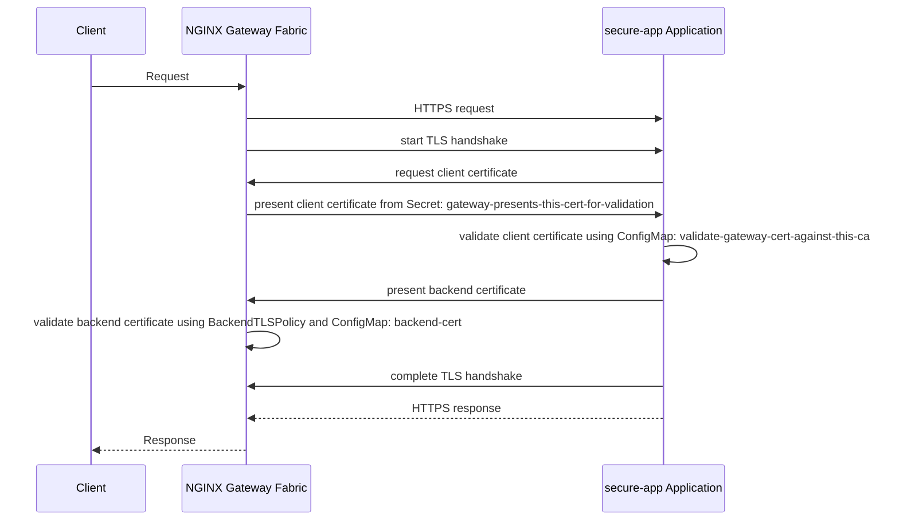

Learn how to encrypt HTTP traffic between NGINX Gateway Fabric and your backend pods using mutual TLS between Gateway and Backend applications.

## Overview

In this guide, you configure the TLS connection from the Gateway to a secure application using [BackendTLSPolicy](https://gateway-api.sigs.k8s.io/api-types/backendtlspolicy/) together with the Gateway’s backend TLS settings. The examples show how to validate the backend’s certificate and present a client certificate, so that traffic between the Gateway and the application is protected with mutual TLS.

The intended use case is when a service or backend owner manages their own HTTPS configuration and certificates, and NGINX Gateway Fabric needs to know how to connect securely to this backend over HTTPS while also proving its own identity with a client certificate. This ensures that all traffic between the Gateway and the application is secured.

The following diagram shows how the mTLS handshake takes place between NGINX Gateway Fabric and the secure-app application:



## Note on Gateway API Experimental Features

 [GatewayBackendTLS](https://gateway-api.sigs.k8s.io/reference/spec/#gatewaybackendtls) is an experimental field. 



## Before you begin

- [Install]() NGINX Gateway Fabric.

## Set up

Create the **secure-app** application in Kubernetes. This application presents its own TLS certificate and requires and validates a client certificate from the Gateway. Copy and paste the following block into your terminal:

```yaml
kubectl apply -f - <<EOF
apiVersion: apps/v1
kind: Deployment
metadata:
  name: secure-app
spec:
  replicas: 1
  selector:
    matchLabels:
      app: secure-app
  template:
    metadata:
      labels:
        app: secure-app
    spec:
      containers:
        - name: secure-app
          image: nginxinc/nginx-unprivileged:latest
          ports:
            - containerPort: 8443
          volumeMounts:
            - name: secret
              mountPath: /etc/nginx/ssl/secret
              readOnly: true
            - name: ca-cert-volume
              mountPath: /etc/nginx/ssl/ca-cert
              readOnly: true
            - name: config-volume
              mountPath: /etc/nginx/conf.d
            - name: nginx-config
              mountPath: /etc/nginx/
      volumes:
        - name: secret
          secret:
            secretName: app-tls-secret
        - name: config-volume
          configMap:
            name: secure-config
        - name: ca-cert-volume
          configMap:
            name: validate-gateway-cert-against-this-ca
        - name: nginx-config
          configMap:
            name: nginx-config
---
apiVersion: v1
kind: Service
metadata:
  name: secure-app
spec:
  ports:
    - port: 8443
      targetPort: 8443
      protocol: TCP
      name: https
  selector:
    app: secure-app
---
apiVersion: v1
kind: ConfigMap
metadata:
  name: secure-config
data:
  app.conf: |-
    server {
        listen 8443 ssl;
        listen [::]:8443 ssl;

        server_name secure-app.example.com;

        default_type text/plain;

        ssl_certificate /etc/nginx/ssl/secret/tls.crt;
        ssl_certificate_key /etc/nginx/ssl/secret/tls.key;

        ssl_client_certificate /etc/nginx/ssl/ca-cert/ca.crt;
        ssl_verify_client on;


        # Enable access logging
        access_log /var/log/nginx/access.log ssl_log;


        location / {
            return 200 "hello from pod secure-app\n";
        }
    }
---
apiVersion: v1
kind: ConfigMap
metadata:
  name: nginx-config
data:
  nginx.conf: |
    worker_processes auto;
    pid /tmp/nginx.pid;

    events {
        worker_connections 1024;
    }

    http {
        log_format ssl_log '$remote_addr ssl_client_verify=$ssl_client_verify ssl_client_subject=$ssl_client_s_dn';
        error_log /var/log/nginx/error.log debug;
        include /etc/nginx/conf.d/*.conf;
    }
---
apiVersion: v1
kind: Secret
metadata:
  name: app-tls-secret
type: Opaque
data:
  tls.crt: LS0tLS1CRUdJTiBDRVJUSUZJQ0FURS0tLS0tCk1JSURhekNDQWxPZ0F3SUJBZ0lVSm82ZHpGa3NEVm1DWklETFgrQ2lzZFEyTElRd0RRWUpLb1pJaHZjTkFRRUwKQlFBd1BURUxNQWtHQTFVRUJoTUNWVk14Q3pBSkJnTlZCQWdNQWtOUE1TRXdId1lEVlFRS0RCaEpiblJsY201bApkQ0JYYVdSbmFYUnpJRkIwZVNCTWRHUXdIaGNOTWpVd09ESXdNakUxT1RBNVdoY05Namd3TlRFMk1qRTFPVEE1CldqQmVNUXN3Q1FZRFZRUUdFd0pWVXpFTE1Ba0dBMVVFQ0F3Q1EwOHhJVEFmQmdOVkJBb01HRWx1ZEdWeWJtVjAKSUZkcFpHZHBkSE1nVUhSNUlFeDBaREVmTUIwR0ExVUVBd3dXYzJWamRYSmxMV0Z3Y0M1bGVHRnRjR3hsTG1OdgpiVENDQVNJd0RRWUpLb1pJaHZjTkFRRUJCUUFEZ2dFUEFEQ0NBUW9DZ2dFQkFMdTRlKzBxRGt6ckN2aXhSQUZICnNvUWUydjhpeUw0dTJNZXN2SkUvalhPN2hSUmxiK0ZJVTltMzVHbTlBUXVlZnhLeE9XM3FRc3Qyckpua2JKN0UKTm9DdG9MdzZweEpZeDgxUFVmdHYyTW5zWTA1bkVYNTlteGd1MjRDeURhZmJGMmtjampjUnNzVXBpMncvWVo1bgpBTFNNSTNWWSsvUnIxT3JsajZrLzdaRHdkV2dhbDAvUGhyZU1uMEt0a1pmbFpvOGhuaitmaVc0M0c5NHZidmd3CjBqTnF5dHhYZ3Y2b1VEQjYwNFhqckZkKyt1MVZVeEtEQ3c1V3JqVlFqNlNHclFnRnpTWU9EZDlLdGljcDBPSmkKSmVYWkwrTG1uNHVSSkxMcVZRNEhaYWtFdzJZeVFzY2RybUlIaHorMWZzNnZ0RW40M0pOTEFWc1VIMTZGeVZaYgo3eUVDQXdFQUFhTkNNRUF3SFFZRFZSME9CQllFRkNDd3d0S2gvWU8vdWdqQzMwZHJHcGN3ZFZ0VE1COEdBMVVkCkl3UVlNQmFBRk1qd20xMVRzMXNtZDlZVEs4dGJoa2FiSVRTcU1BMEdDU3FHU0liM0RRRUJDd1VBQTRJQkFRQWYKSWFpdlN2aUNIMThMZHhHRHZLL2pITjFhZHBTQjFUTzg5OE8vZXVUczh1SVB3V1VKN0ZHbTJEcFJLd254bk5qMAp1WVdBWGRJYkhzYTZiN0lINVdTemozRGJZTms2WnpTWmtNcHhQN252RXVNU0c1V2MyQ3FhOTIzYitKU2g0WEJJCjhiZmNoc1krZGFpRFlLNk5rdldYY0Fxd1Y3MUY1cnRUTXc0blpGOGhXSWtManlLUDJYeExYUzBlTHZBZklSOC8KMVRxN01xWXFJSkxURmVlREQ4TXg1OUFQYktsYzFTREIxUlpqdTRZYzdaWnc4N3ZrRzFqSnk1RkU0TkUxRzRmdwpQSHIwb2NiUFREeUxTQjNGdlJzeDZaMVMyejVVQVhDR2R5bnp1VU9KL0IrT0ZYZ2YxbURUUTlRbHltcjVFWmk4Cm5nZU1NbGl3WkdIWGJaM2dIeFlxCi0tLS0tRU5EIENFUlRJRklDQVRFLS0tLS0K
  tls.key: LS0tLS1CRUdJTiBQUklWQVRFIEtFWS0tLS0tCk1JSUV2UUlCQURBTkJna3Foa2lHOXcwQkFRRUZBQVNDQktjd2dnU2pBZ0VBQW9JQkFRQzd1SHZ0S2c1TTZ3cjQKc1VRQlI3S0VIdHIvSXNpK0x0akhyTHlSUDQxenU0VVVaVy9oU0ZQWnQrUnB2UUVMbm44U3NUbHQ2a0xMZHF5Wgo1R3lleERhQXJhQzhPcWNTV01mTlQxSDdiOWpKN0dOT1p4RitmWnNZTHR1QXNnMm4yeGRwSEk0M0ViTEZLWXRzClAyR2Vad0MwakNOMVdQdjBhOVRxNVkrcFArMlE4SFZvR3BkUHo0YTNqSjlDclpHWDVXYVBJWjQvbjRsdU54dmUKTDI3NE1OSXphc3JjVjRMK3FGQXdldE9GNDZ4WGZ2cnRWVk1TZ3dzT1ZxNDFVSStraHEwSUJjMG1EZzNmU3JZbgpLZERpWWlYbDJTL2k1cCtMa1NTeTZsVU9CMldwQk1ObU1rTEhIYTVpQjRjL3RYN09yN1JKK055VFN3RmJGQjllCmhjbFdXKzhoQWdNQkFBRUNnZ0VBRUlDLytGSWRycnB0SFA3c2hSWktCZDUyano1K0dtWWc3YkRzWlBLSzIzVk4KVmtVeXFFSUZDUnRuQzdxdmVGZUhRVnZ1T2hFQnJVUnlHUmRoU3pYaHVyOUk1Yk5jVTdzVldhSFRDY0ZEOUVDQgpYSGVvTEpBYlRlMTBvNlJEbWhHalJiemFiZEh5L3UxUGtnVWlibHdNemxLUm5YUGt0cEN5UjdKRnhuSFZ6MHVGCng1dlM4OHAzRXJENWhlNzl3VVNOc2xvaFNhYUxVNERkMWZJclVuWHlmc3V3WkpFZEZPa3pPT1diYm94RUF2b00KYlliUERLMWxTcXhLT0t2TzVja20zVTZSYTZvcXFGSDdEbkpVZENsNVRBZ25kOVVSd0JwbWtBRTdHdnJ6TTNiMQpOaTE2UkJWSi9zSzJKUGs5MkZnelpaek9LS2ZXa2FEUkdBVHJCeXl6UndLQmdRRHNVQjNpT0JaSzVPb2xHRUZKCncxOTFoWS84V2crVytpOXN1d1pSZ2VqT1pvSDRjVER2TnRQSUxxQ09pV3R4L091c2VZc1hoQ0V0L25kMzBnUWEKVC9yVS85Ums5cXdMK1pVZmR5YkdPVjR3M1ExbmpRdlVva0xtblpXSmZneldNRCttT21WZFV0elg4LzRxUGxhRwowQVB4azl3MldHZFJFeW90czJXSVdaUHo5d0tCZ1FETFhBZ09xZ3R3eDZLcTZhT2l0TU1na0FJYnB3MStRbGh5CnNkdEhiRkQrQTJ1ZnUwTkw2TWx3ZWNqV1VicEFwd3F0K3NuckVRL1IwVU1yUEttNFNWTWtEdmpWZFJnWjZmSlAKeHFJZG9pZGZPb3B4cTI1Qys4aHlvU0JRcHRaRjMxdkJlbE82K1QwSS9nTWFQSnJrL3ZVczJQdVVSK2lMUlJOQgp1TGpQNFNJL3B3S0JnR25qUkdDM2JSWEdHVHpoNzI5VUFoUXc4dUhLb1MydmtVeVJTVFdBbG9iVjIrc3RIUll6ClpSWlAvbFdnTWVyenY4NmE3NzVyMEVwQnVkcVEycEhId01kc2t3bGlscGtQRHNqNHBRRXhkNGxCbzk0QWo0cUoKNHB4ZmhFQUZvVTdnYzhUU2FkVTFhZ3ZDSXVOZTUzcWsvdjlpbDh3cU5MRlpldzdiVWVXVTdmemxBb0dBTVZmdApaSkdDSVNWdnBRVDMvWnphMCtYZGZSUTF3L01aUHd0RTU3bXlsVkFESjBqcTlWcFF0b2YyWVhxSE5QVFROSS9yCnVxdnpLTGdjRWp1dit0VmY1Um4wNnVaMHFLVUpkSzMvM0N6aVhNcjVtTWMrQStiUUpuQk9SUU9XYm5IWjg4SlkKMnI5clBlbFVtMk1sT25kYXlqMEVIbUNzWGs2dWMzMzg2Z1A0cVhVQ2dZRUFwNkNEeGVKM2pNdG5RTHdFNU9LSwp1V1dGU0ltL3RSYURoMTJvaUdGQkY1N0lMdlkzdUcvZVdYUXJ3RUZYZFQ5V1lWWFFVVVVWdXg0VlhSZHdqWVZsCk5kcjZlc2tTQmFJYWxuRkczRG9SOUJSTHRFekJSaVA4UUtZVlJzYVp6Z2ZhK1B2cm14cmpLR3ZxUnpXbWNyR1gKSnlpVDZMMjNDTmY1bzJMRHErN0p1Mzg9Ci0tLS0tRU5EIFBSSVZBVEUgS0VZLS0tLS0K
---
kind: ConfigMap
apiVersion: v1
metadata:
  name: validate-gateway-cert-against-this-ca
data:
  ca.crt: |
    -----BEGIN CERTIFICATE-----
    MIIDWzCCAkOgAwIBAgIULcvHW5CfsuZSwAgUMnCSf+JS7lUwDQYJKoZIhvcNAQEL
    BQAwPTELMAkGA1UEBhMCVVMxCzAJBgNVBAgMAkNPMSEwHwYDVQQKDBhJbnRlcm5l
    dCBXaWRnaXRzIFB0eSBMdGQwHhcNMjUwODIwMjE1NzE3WhcNMjYwODIwMjE1NzE3
    WjA9MQswCQYDVQQGEwJVUzELMAkGA1UECAwCQ08xITAfBgNVBAoMGEludGVybmV0
    IFdpZGdpdHMgUHR5IEx0ZDCCASIwDQYJKoZIhvcNAQEBBQADggEPADCCAQoCggEB
    ALF+GOHlmtcSh3oagcA0AdiLGR/MI5FA+1Zp3EkyrbtTM8NFv2YNntpoHQstl1no
    8eoKzxcnallG6CNQpaOzuApEvoeUxbNtDpZ28dsgMX4QpZ627oob0DweAhSJ8+lL
    dPmopjWKwWzoYEvvzjsozLg/utrd/ZN5zr1KACPq/hm8jzI0I2oRCQj90vo1T+q0
    E2saMiPTPLX9cQNPJPhEYLpHuH/EIZNK7++p1qKLneTejWoxtyK1lCP/fPpJojce
    ninF+Nphu4lEW9Gu7KFKHV9WMptWUa7L1SItoVWK5ydhDXV+bSXB6Wz3AqIIxoyI
    CCjtfuiXri8jWSHzHsm1RUECAwEAAaNTMFEwHQYDVR0OBBYEFMjwm11Ts1smd9YT
    K8tbhkabITSqMB8GA1UdIwQYMBaAFMjwm11Ts1smd9YTK8tbhkabITSqMA8GA1Ud
    EwEB/wQFMAMBAf8wDQYJKoZIhvcNAQELBQADggEBACNsDoUDOWBJq22VsiEeCnW3
    h5SUn11OstDZiHkD84hZ6THywwEG2y2j28LOJZ71tNqjjCU4c1zmknvd4DddTwdF
    MMOb1l164GKdSGzXEKMi4TaRnqPS2+PWate3bRTYOHwLMnVM745moQjDO0YHoEu6
    E8xsKrgeweVIHsunjf76ZGXdN746AXZLryQHvKhxOMn8jZoKSRSfqtNiI9B8rpkG
    ruHV5m1P9VYQ4HTvUemw+1jgIjtrOWVdT2U1oozCVAumNqPk6FoJ+yOMYXs/40oq
    cdNQ++hAYJnxspHPnkI0r7q2nCqTxrKSOJt4vogOrn0DLVpS99CgfYrVhKihYKM=
    -----END CERTIFICATE-----
EOF
```

This creates the **secure-app** a service and deployment, as well as a Secret that holds the certificate and key used by the backend to decrypt the HTTPS traffic. The application is configured to accept only HTTPS traffic. It also creates a CA certificate that the backend uses to verify the Gateway’s client certificate, and the application is configured to require that identification.

Run the following command to verify the resources were created:

```shell
kubectl get pods,svc
```

Your output should include the **secure-app** pod and the **secure-app** service:

```text
NAME                          READY   STATUS      RESTARTS   AGE
pod/secure-app-868cfd5b5-v7gwk   1/1     Running   0          9s

NAME                 TYPE        CLUSTER-IP     EXTERNAL-IP   PORT(S)   AGE
service/secure-app   ClusterIP   10.96.213.57   <none>        8443/TCP  9s
```

## Configure routing rules

First, create the Gateway resource with an HTTP listener:

```yaml
kubectl apply -f - <<EOF
apiVersion: gateway.networking.k8s.io/v1
kind: Gateway
metadata:
  name: gateway
spec:
  gatewayClassName: nginx
  listeners:
  - name: http
    port: 80
    protocol: HTTP
EOF
```

Next, create a HTTPRoute to route traffic to the secure-app backend:

```yaml
kubectl apply -f - <<EOF
apiVersion: gateway.networking.k8s.io/v1
kind: HTTPRoute
metadata:
  name: secure-app
spec:
  parentRefs:
  - name: gateway
    sectionName: http
  hostnames:
  - "secure-app.example.com"
  rules:
  - matches:
    - path:
        type: PathPrefix
        value: /
    backendRefs:
    - name: secure-app
      port: 8443
EOF
```

After creating the Gateway resource, NGINX Gateway Fabric will provision an NGINX Pod and Service fronting it to route traffic.

Save the public IP address and port of the NGINX Service into shell variables:

```text
GW_IP=XXX.YYY.ZZZ.III
GW_PORT=<port number>
```

In a production environment, you should have a DNS record for the external IP address that is exposed, and it should refer to the hostname that the gateway will forward for.

---

## Send traffic without mutual TLS configured

Using the external IP address and port for the NGINX Service, send traffic to the secure-app application. To show what happens before we configure backend TLS and have the Gateway present its client certificate for verification, send a request now and observe how the connection to the application fails with a bad request error.

If you have a DNS record allocated for `secure-app.example.com`, you can send the request directly to that hostname, without needing to resolve.

```shell
curl --resolve secure-app.example.com:$GW_PORT:$GW_IP http://secure-app.example.com:$GW_PORT/
```

```text
<html>
<head><title>400 The plain HTTP request was sent to HTTPS port</title></head>
<body>
<center><h1>400 Bad Request</h1></center>
<center>The plain HTTP request was sent to HTTPS port</center>
<hr><center>nginx/1.29.2</center>
</body>
</html>
```

We can see a status 400 Bad Request message from NGINX.

---

## Configure TLS for Gateway and Backend applications

 This example uses a `ConfigMap` to store the CA certificate, but you can also use a `Secret`. This could be a better option if integrating with [cert-manager](https://cert-manager.io/). The `Secret` should have a `ca.crt` key that holds the contents of the CA certificate. 

We need to create a Secret that holds the Gateway’s client certificate and update the Gateway so that it presents this certificate to the backend to verify its identity. In this example, the certificate is signed by a CA labeled `gateway`. Create the `Secret` and `Gateway` in Kubernetes by copying and pasting the following block into your terminal:

```yaml
kubectl apply -f - <<EOF
kind: Secret
apiVersion: v1
metadata:
  name: gateway-presents-this-cert-for-validation
type: kubernetes.io/tls
data: 
  tls.crt: LS0tLS1CRUdJTiBDRVJUSUZJQ0FURS0tLS0tCk1JSURIekNDQWdlZ0F3SUJBZ0lVSm82ZHpGa3NEVm1DWklETFgrQ2lzZFEyTElrd0RRWUpLb1pJaHZjTkFRRUwKQlFBd1BURUxNQWtHQTFVRUJoTUNWVk14Q3pBSkJnTlZCQWdNQWtOUE1TRXdId1lEVlFRS0RCaEpiblJsY201bApkQ0JYYVdSbmFYUnpJRkIwZVNCTWRHUXdIaGNOTWpVd09URXdNRFEwT1RRNFdoY05Nall3T1RFd01EUTBPVFE0CldqQVNNUkF3RGdZRFZRUUREQWRuWVhSbGQyRjVNSUlCSWpBTkJna3Foa2lHOXcwQkFRRUZBQU9DQVE4QU1JSUIKQ2dLQ0FRRUFrMy9tS2Nxb3JrVWtXTkJNTWhwd3Y0SjBvZ3d3bHR6ZFhXK0hxZzNjczNJT3g0TmpkQUNLb3QxdAo4VWQ0UGRRRGYvLyttZ3A0elQvRklSR2hoTy9vUG8rMCtlYmZjWUdLakNiaUQ2UWgyeFJKeDEzWnJzR3djT3YyCjRiU2FiOXVhSVRjMDQzSlFqaVhBUXdyc2hoamJSMklzdzIzNG5TYmJMUHJMaE9iL3ZJRTREN3NPZ1ZwOU1aam0KOS9VNG8ra21ma0V4Rnk5SUZJWXo4UldPaFJQQ0FXcFNoelFBa0V3bnorcDBQKzFsTGZYVnpZczQvS0ErbDJGQwppbTNNVldPb0pkTGY5TXJpN3BvTUV2VHJCNmh6ZDJVVkgzc0VNcFRobzdlREZ1S3VDaUpSSzhzVm1odHo2TGZZCldKYXJYUmNxdFQyR0RLWVZDaHoxU3l2d2xwbWtlUUlEQVFBQm8wSXdRREFkQmdOVkhRNEVGZ1FVTDNrQ1JaMm0KMXovd0F4bVhMUVFXR21zcmVGUXdId1lEVlIwakJCZ3dGb0FVeVBDYlhWT3pXeVozMWhNcnkxdUdScHNoTktvdwpEUVlKS29aSWh2Y05BUUVMQlFBRGdnRUJBQ083VTAxc3FFMm1Hd1dWb3VZZ3g4NXR4Y0hpZXFtOW1YNUdEMXRHCjZqcmtIMUdKTnUrOTRXbEgxdEpLT1kzS091bFp6NW1oQ05vRGpMemtkQkRXbHl0SnhDL0dYdHNUbUxRTXNDQTUKdldUcngwaG1EZjNsY25RWjdYanl2aStFWHhWSWFJU1R0djRWZTN2a2FScVJ3YUt0M0NtN0UrK21RSFI5eVZpegpHUXlkT2xZTkplaHptS3djSkY5ZVQvUG5ucTZ3WTEzWnE5U202YmFnY2V2VlNmbkp0R0svWURMZUQ1RnBINElrCmU0ajdhVUN5Nk9VcUtibkdWS1FOdmlGVHJHS2dMU0thVHNBNy9sWi80UUI5d2JvaXdpMjFZczFtT0ZTRmwvV2oKS3EybktwNzN0dE5BV1k4OGNiZlhLcHlGSUh4QlI2SXZUNHVmK21mQW5jV2lMUTQ9Ci0tLS0tRU5EIENFUlRJRklDQVRFLS0tLS0K
  tls.key: LS0tLS1CRUdJTiBQUklWQVRFIEtFWS0tLS0tCk1JSUV2UUlCQURBTkJna3Foa2lHOXcwQkFRRUZBQVNDQktjd2dnU2pBZ0VBQW9JQkFRQ1RmK1lweXFpdVJTUlkKMEV3eUduQy9nblNpRERDVzNOMWRiNGVxRGR5emNnN0hnMk4wQUlxaTNXM3hSM2c5MUFOLy8vNmFDbmpOUDhVaApFYUdFNytnK2o3VDU1dDl4Z1lxTUp1SVBwQ0hiRkVuSFhkbXV3YkJ3Ni9iaHRKcHYyNW9oTnpUamNsQ09KY0JECkN1eUdHTnRIWWl6RGJmaWRKdHNzK3N1RTV2KzhnVGdQdXc2QlduMHhtT2IzOVRpajZTWitRVEVYTDBnVWhqUHgKRlk2RkU4SUJhbEtITkFDUVRDZlA2blEvN1dVdDlkWE5pemo4b0Q2WFlVS0tiY3hWWTZnbDB0LzB5dUx1bWd3Uwo5T3NIcUhOM1pSVWZld1F5bE9HanQ0TVc0cTRLSWxFcnl4V2FHM1BvdDloWWxxdGRGeXExUFlZTXBoVUtIUFZMCksvQ1dtYVI1QWdNQkFBRUNnZ0VBRGxGQWJMY1V4NUhEbFBGbkxBZmdBTjd2WmxscmtBRlJaWVB4ZGNMUnRRTngKeHRFTW90SjRvcFYrMmdoWGRoengyQWRuMWRrRlg5cjhUaGp4aGo5cFdrVkZ5bW9zTDA3bFBYUjZ4Z3puRW1aMgpRT2x0dTJabXM1ZGNDQTJwWGdsQmZVN29EZG5uVXR6OFBDVy96c1p6NW9wemtPYklWcXpTWXB2WGpJZUZ0R3pxCjRweXYvSzZ2MFdsRldaR2hnU2xnQTdia2hVMkFVUnVWNzMxT254bWtOeEFOWlIwUVJHVnl6alJZRzNIaVIvdkEKU2lCNExrNi9HOXlzVGZEQTE5Vk9qZUNyU2cwVHNTWkVKelNUVU1VcXJXMGdIUXQ4Sno1YzJqRGFXb2hTeE9xawpmZTNZaEU1OVhGb0crZ2hMMnJnSDlCZWxkUndIVzNSR0NZbzhOM3hxMXdLQmdRREYycnJVQjRVL3hYTUZOQmxoCnFQUmM1QnBjQUoyYzhjMnVzL2Q2dGVGdkhTbkxEQ3FHSGpOaDZaUGpPYlAzT2dESE42RDM2SlZYazFsUWo0WE0KbGptU2xVOHRjMFpWeHlFOTdybkRDcExwVjhCZUxqYmsvdGFmRnQzQUlCbVVnckdXQzdyWjRiK29tazh2THh5Rgo5Y21MUGxFcFNSVS95QXpjZ0d1WGRVOXFnd0tCZ1FDKzJNMnBCckdCUkVPMS9QYUpsVC9LcWp0dFJwMy9kV0hHCjVBTUNsdWhPVU4vekxvOEJudFpZYWo3a1FPQ2xlT1ZLalJ5YTA3MFpBeDAvS091MXdoaVZYYTRCVDZuSklEcmgKY0ZIVTcyY05UeDNzRTBSR1hsdmlZN3d1amtvMFRPNlNWa2Fwc2hTZWl4a3dpTEx6emZjaXY5YUNSNFVrNExFZwpPV0xRczFLMFV3S0JnRTVGRnorbHNmcm1XM2dsZ2h6MlA2VTN2NDNCMkpncnVCaHlyV1puNlVTUm51VHFiVEFkClptcEhndStTOWpUSlIyR0lDaS9JWEx3R1dJRGNKaXduQ2FPSldZYzdZUW14K3Q2TFFBVitlMXZBRVNPdzJKcUMKamRqbHJOZkNXeHc3RDVHeUZqcjNhV0NEbXV1cGtYa1ZJS1ByQlNSMSt1ZitkY2dOTFlML0wybU5Bb0dCQUpkVAoxZytXN1IweEFmZkdNNzc0aDNLdDlSMDdCNEZPbEU5ZThUd1dhUEhna3hPQzhZWTVhb0VGRGdWenBDM1JaUTd1ClFhWkxDd0JRUmRxVkdnSXZlOHJFVTN0YXJhaDdVL1Q2V1FqZEkvdWJwb0JRN3F4Vm1jb3poejNyT2MrcXlPbGsKVy9lbTYwNmp3VCtJeFUwcEhqT0JwaGY3bWdtWjJSbFNKNWFRK3AxZEFvR0FaSHNWYTJYZFRmQXhBZGpQb3NIUwpnL2Rva3oyVnZ1ak81YllKTjhMRkNKSWFPc1lxR2lnand5ZmIrS0F2Y0trNHRWMkJtS09YcHdZckNJTmpNRWN4ClhtcG80ekw2L2pCTEZOYmxZQ293eDJPM0FXZkhZNS9xME9zb2VOcTFTM0MzZHl0b2Z6M213Y1RLcjZCVW5zR2IKc3o1N2ZLaGE4V1FuZHVPTUNNRjEwaEk9Ci0tLS0tRU5EIFBSSVZBVEUgS0VZLS0tLS0K
---
apiVersion: gateway.networking.k8s.io/v1
kind: Gateway
metadata:
  name: gateway
spec:
  gatewayClassName: nginx
  listeners:
  - name: http
    port: 80
    protocol: HTTP
  tls:
    backend:
      clientCertificateRef:
        name: gateway-presents-this-cert-for-validation
        kind : Secret
EOF
```

To configure the backend TLS termination, create the ConfigMap that holds the `ca.crt` entry for verifying our self-signed certificates:

```yaml
kubectl apply -f - <<EOF
kind: ConfigMap
apiVersion: v1
metadata:
  name: backend-cert
data:
  ca.crt: |
    -----BEGIN CERTIFICATE-----
    MIIFlzCCA3+gAwIBAgIULQcgBeB9ApX+Wf+FYLMLAVOLwYIwDQYJKoZIhvcNAQEL
    BQAwWzELMAkGA1UEBhMCVVMxCzAJBgNVBAgMAldBMRAwDgYDVQQHDAdTZWF0dGxl
    MRMwEQYDVQQKDApFeGFtcGxlIENBMRgwFgYDVQQDDA9FeGFtcGxlIFJvb3QgQ0Ew
    HhcNMjUwNjE2MTUzNjQzWhcNMzUwNjE0MTUzNjQzWjBbMQswCQYDVQQGEwJVUzEL
    MAkGA1UECAwCV0ExEDAOBgNVBAcMB1NlYXR0bGUxEzARBgNVBAoMCkV4YW1wbGUg
    Q0ExGDAWBgNVBAMMD0V4YW1wbGUgUm9vdCBDQTCCAiIwDQYJKoZIhvcNAQEBBQAD
    ggIPADCCAgoCggIBAI4fKNzZU/9IEifa6k9L38Ei4lFwFt6wjCZt70Rb5IpJfOkr
    PsZf+XaCgIQZh3ZTBIPZoa2uNxVF1BoKEhEqzGdWdH82lVDmbkSaLeW4YnYhM9fe
    IuYHqyVrNFsp7M+xJD3XWwwCXDN//H+vx8JLQIOX4tQ9RM4rB7avcu0rmaXJuqJi
    N0AU8AsEFpoIiC/vFBucqpG2KzC+FsVPe/Ri+PQTWJ6aLVUvGJ3hXRAQdOMzIGys
    +WTugzqk+Sv9pKDB7/EMJg+5IagNP5QWrDmdBwROdRhd8wq+zYJMxVaaSqetNrnY
    aqWPdGj+RSB5YuiL8kwDiJOPc5G4t2I/hbol5hpBleL84qijclzJQeFOKdEbRzMa
    w2QfyZxZ24TCZGwDzs480x5bKmUoRufdk8X4DSjV4tnKMh9sfHX3w4cokp2IWBqt
    B59HMN4nAKELftjfKjI9L0jnEbJR/Xae0qPLxjAuN0HARQNx1/EvvsWGhgu4Sr5S
    Ua604wHU9p85a5zWOgOJ471f/sA3q2yEiiHPYqbZ2YXmVMrHvMROO5EVCN7HOjoL
    QW4z85fX7QT3OwF6Xckk8jA45tcy0cIlOHsl19XbZUJ5Gc7jAiYbmy2IRYgNiMmb
    iSBL0eoC2jan1Y6Of0UcOiAfsMvt5f21dehYkP7Mwe7sGmMk8Lkva1PRSUFfAgMB
    AAGjUzBRMB0GA1UdDgQWBBTjn9MO3RBD27gvfL1FP2e2ARoGrjAfBgNVHSMEGDAW
    gBTjn9MO3RBD27gvfL1FP2e2ARoGrjAPBgNVHRMBAf8EBTADAQH/MA0GCSqGSIb3
    DQEBCwUAA4ICAQBD/b0Vu1vbRYQIeBbaPLCHS5IO8R2G18w+RyUBYpcr50FLI81X
    YPTCnEXw5sVd7Y7PNZ6q3crr4u/tGWwDWr9vHL5YWApEnUJzdp9NGv9Z29pgRrQS
    Dzr+ggv8/NRMy4xFZ/U5JKy1lHgNFhSp68PrZI6T4xN3zyTCj29qC9hxoxhYpbXS
    1m3PB84T1VqZu2dwNZll+kOIMv+Qon8MWZbuGLkFrcxuDqHB6RRAWyRB7WKKZZXu
    r+Uw+9+0htNcASNuEx1yXUaE9Bf9V22fs4ARilP2QpFtMN8BCVQiKp8tj+em3ZX0
    5KfUavNIZekrHKn/3pc9M+PhX+CEPLNncgywBVYZN89ZujyNVCKVwWD3LmH5NZ8w
    JMJ9f3SC8ZqTu7xqX6FVLvmNAm5sS7lE8M0wGzp9cZHHEmstC1//jc+JzhRu8XyU
    wGJyANVFlPn7+nnSq7dWbv4OTFsurbWrHQlzwjHaht84DGR4E0QgLUtA+ICGU0Ig
    3/Ma5N7Jugw2mbx8NupgOE3AL6aScbuSt2E1/4QZ2uNPh8soxbANu9WbEXOXzxd5
    LItmVd4ltG/4i2qwLu4NLSNA56iaCDIRD/cfr6WmNLfcMTGRMIJ+AlxnETAIy+pK
    s6cpSfBLcDUhStgvr5oNDFeCbmsXRgyJZE9I4mKijG8v+LkS9RgKsS7tRw==
    -----END CERTIFICATE-----
EOF
```

Next, we create the Backend TLS Policy which targets our `secure-app` Service and refers to the ConfigMap created in the previous step:

```yaml
kubectl apply -f - <<EOF
apiVersion: gateway.networking.k8s.io/v1
kind: BackendTLSPolicy
metadata:
  name: backend-tls
spec:
  targetRefs:
  - group: ''
    kind: Service
    name: secure-app
  validation:
    caCertificateRefs:
    - name: backend-cert
      group: ''
      kind: ConfigMap
    hostname: secure-app.example.com
EOF
```

To confirm the Policy was created and attached successfully, we can run a describe on the BackendTLSPolicy object:

```shell
kubectl describe backendtlspolicies.gateway.networking.k8s.io
```

```text
Name:         backend-tls
Namespace:    default
Labels:       <none>
Annotations:  <none>
API Version:  gateway.networking.k8s.io/v1
Kind:         BackendTLSPolicy
Metadata:
  Creation Timestamp:  2025-11-13T23:28:36Z
  Generation:          1
  Resource Version:    1288
  UID:                 d7e3f026-afe3-44d1-aed5-c168e954b52f
Spec:
  Target Refs:
    Group:  
    Kind:   Service
    Name:   secure-app
  Validation:
    Ca Certificate Refs:
      Group:   
      Kind:    ConfigMap
      Name:    backend-cert
    Hostname:  secure-app.example.com
Status:
  Ancestors:
    Ancestor Ref:
      Group:      gateway.networking.k8s.io
      Kind:       Gateway
      Name:       gateway
      Namespace:  default
    Conditions:
      Last Transition Time:  2025-11-13T23:28:37Z
      Message:               All CACertificateRefs are resolved
      Observed Generation:   1
      Reason:                ResolvedRefs
      Status:                True
      Type:                  ResolvedRefs
      Last Transition Time:  2025-11-13T23:28:37Z
      Message:               The Policy is accepted
      Observed Generation:   1
      Reason:                Accepted
      Status:                True
      Type:                  Accepted
    Controller Name:         gateway.nginx.org/nginx-gateway-controller
Events:                      <none>
```

---

## Send traffic with backend TLS configuration

Now send traffic again:

```shell
curl --resolve secure-app.example.com:$GW_PORT:$GW_IP http://secure-app.example.com:$GW_PORT/
```

```text
hello from pod secure-app
```

To verify that the backend validated the gateway’s client certificate, inspect the logs of the `secure-app` pod and check the reported client subject:

```shell
POD_NAME=$(kubectl get pod -l app=secure-app -o jsonpath='{.items[0].metadata.name}')
kubectl logs "$POD_NAME"
```

```text
10.244.0.145 ssl_client_verify=SUCCESS ssl_client_subject=CN=gateway
```

---

## See also

To learn more about configuring backend TLS termination using the Gateway API, see the following resources:

- [Backend TLS Policy](https://gateway-api.sigs.k8s.io/api-types/backendtlspolicy/)
- [Backend TLS Policy GEP](https://gateway-api.sigs.k8s.io/geps/gep-1897/)
- [Gateway Backend TLS](https://gateway-api.sigs.k8s.io/reference/spec/#gatewaybackendtls)
