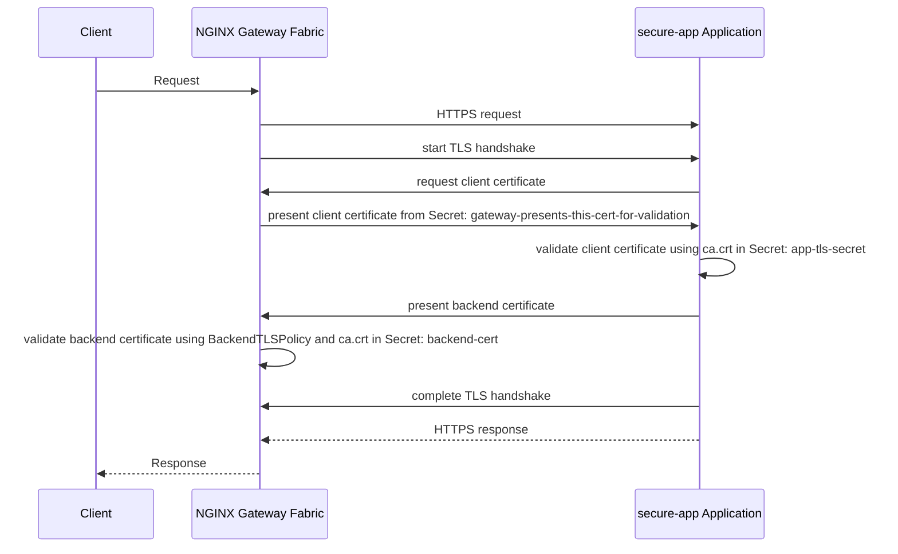

Learn how to encrypt HTTP traffic between NGINX Gateway Fabric and your backend pods using mutual TLS between Gateway and Backend applications.

## Overview

In this guide, you configure the TLS connection from the Gateway to a secure application using [BackendTLSPolicy](https://gateway-api.sigs.k8s.io/api-types/backendtlspolicy/) together with the Gateway’s backend TLS settings. The examples show how to validate the backend’s certificate and present a client certificate, so that traffic between the Gateway and the application is protected with mutual TLS.

The intended use case is when a service or backend owner manages their own HTTPS configuration and certificates, and NGINX Gateway Fabric needs to know how to connect securely to this backend over HTTPS while also proving its own identity with a client certificate. This ensures that all traffic between the Gateway and the application is secured.

The following diagram shows how the mTLS handshake takes place between NGINX Gateway Fabric and the secure-app application:


```mermaid
sequenceDiagram
    participant client as Client
    participant gw as NGINX Gateway Fabric
    participant app as secure-app Application

    client->>gw: Request
    gw->>app: HTTPS request
    gw->>app: start TLS handshake
    app->>gw: request client certificate
    gw->>app: present client certificate from Secret: gateway-presents-this-cert-for-validation
    app->>app: validate client certificate using ca.crt in Secret: app-tls-secret
    app->>gw: present backend certificate
    gw->>gw: validate backend certificate using BackendTLSPolicy and ca.crt in Secret: backend-cert
    app->>gw: complete TLS handshake
    app-->>gw: HTTPS response
    gw-->>client: Response
```

## Before you begin

- [Install]() NGINX Gateway Fabric.

## Set up





To issue the backend server certificate, cert-manager creates the `app-tls-secret` Secret containing `tls.crt`, `tls.key`, and the local CA in `ca.crt`. The `secure-app` Pod uses `tls.crt`/`tls.key` to terminate HTTPS and uses `ca.crt` to validate the Gateway's client certificate:

```yaml
kubectl apply -f - <<EOF
apiVersion: cert-manager.io/v1
kind: Certificate
metadata:
  name: secure-app-cert
  namespace: default
spec:
  secretName: app-tls-secret
  issuerRef:
    name: local-ca-issuer
    kind: ClusterIssuer
  commonName: secure-app.example.com
  dnsNames:
  - secure-app.example.com
EOF
```

Create the **secure-app** application in Kubernetes. Copy and paste the following block into your terminal:

```yaml
kubectl apply -f - <<EOF
apiVersion: apps/v1
kind: Deployment
metadata:
  name: secure-app
spec:
  replicas: 1
  selector:
    matchLabels:
      app: secure-app
  template:
    metadata:
      labels:
        app: secure-app
    spec:
      containers:
        - name: secure-app
          image: nginxinc/nginx-unprivileged:latest
          ports:
            - containerPort: 8443
          volumeMounts:
            - name: secret
              mountPath: /etc/nginx/ssl/secret
              readOnly: true
            - name: config-volume
              mountPath: /etc/nginx/conf.d
            - name: nginx-config
              mountPath: /etc/nginx/
      volumes:
        - name: secret
          secret:
            secretName: app-tls-secret
        - name: config-volume
          configMap:
            name: secure-config
        - name: nginx-config
          configMap:
            name: nginx-config
---
apiVersion: v1
kind: Service
metadata:
  name: secure-app
spec:
  ports:
    - port: 8443
      targetPort: 8443
      protocol: TCP
      name: https
  selector:
    app: secure-app
---
apiVersion: v1
kind: ConfigMap
metadata:
  name: secure-config
data:
  app.conf: |-
    server {
        listen 8443 ssl;
        listen [::]:8443 ssl;

        server_name secure-app.example.com;

        default_type text/plain;

        ssl_certificate /etc/nginx/ssl/secret/tls.crt;
        ssl_certificate_key /etc/nginx/ssl/secret/tls.key;

        ssl_client_certificate /etc/nginx/ssl/secret/ca.crt;
        ssl_verify_client on;


        # Enable access logging
        access_log /var/log/nginx/access.log ssl_log;


        location / {
            return 200 "hello from pod secure-app\n";
        }
    }
---
apiVersion: v1
kind: ConfigMap
metadata:
  name: nginx-config
data:
  nginx.conf: |
    worker_processes auto;
    pid /tmp/nginx.pid;

    events {
        worker_connections 1024;
    }

    http {
        log_format ssl_log '$remote_addr ssl_client_verify=$ssl_client_verify ssl_client_subject=$ssl_client_s_dn';
        error_log /var/log/nginx/error.log debug;
        include /etc/nginx/conf.d/*.conf;
    }
EOF
```

This creates the **secure-app** Service and Deployment, configured to accept only HTTPS traffic. The Pod mounts the secret `app-tls-secret` so it can both terminate HTTPS and validate the Gateway's client certificate.

Run the following command to verify the resources were created:

```shell
kubectl get pods,svc
```

Your output should include the **secure-app** pod and the **secure-app** service:

```text
NAME                          READY   STATUS      RESTARTS   AGE
pod/secure-app-868cfd5b5-v7gwk   1/1     Running   0          9s

NAME                 TYPE        CLUSTER-IP     EXTERNAL-IP   PORT(S)   AGE
service/secure-app   ClusterIP   10.96.213.57   <none>        8443/TCP  9s
```

## Configure routing rules

First, create the Gateway resource with an HTTP listener:

```yaml
kubectl apply -f - <<EOF
apiVersion: gateway.networking.k8s.io/v1
kind: Gateway
metadata:
  name: gateway
spec:
  gatewayClassName: nginx
  listeners:
  - name: http
    port: 80
    protocol: HTTP
EOF
```

Next, create a HTTPRoute to route traffic to the secure-app backend:

```yaml
kubectl apply -f - <<EOF
apiVersion: gateway.networking.k8s.io/v1
kind: HTTPRoute
metadata:
  name: secure-app
spec:
  parentRefs:
  - name: gateway
    sectionName: http
  hostnames:
  - "secure-app.example.com"
  rules:
  - matches:
    - path:
        type: PathPrefix
        value: /
    backendRefs:
    - name: secure-app
      port: 8443
EOF
```

After creating the Gateway resource, NGINX Gateway Fabric will provision an NGINX Pod and Service fronting it to route traffic. Verify the gateway is created:

```shell
kubectl describe gateways.gateway.networking.k8s.io gateway
```

Verify the status is `Accepted`:

```text
Status:
  Addresses:
    Type:   IPAddress
    Value:  10.96.36.219
  Conditions:
    Last Transition Time:  2026-01-09T05:40:37Z
    Message:               The Gateway is accepted
    Observed Generation:   1
    Reason:                Accepted
    Status:                True
    Type:                  Accepted
    Last Transition Time:  2026-01-09T05:40:37Z
    Message:               The Gateway is programmed
    Observed Generation:   1
    Reason:                Programmed
    Status:                True
    Type:                  Programmed
```

Save the public IP address and port(s) of the Gateway into shell variables:

```text
GW_IP=XXX.YYY.ZZZ.III
GW_PORT=<port number>
```

In a production environment, you should have a DNS record for the external IP address that is exposed, and it should refer to the hostname that the gateway will forward for.

---

## Send traffic without mutual TLS configured

Using the external IP address and port for the NGINX Service, send traffic to the secure-app application. To show what happens before we configure backend TLS and have the Gateway present its client certificate for verification, send a request now and observe how the connection to the application fails with a bad request error.

If you have a DNS record allocated for `secure-app.example.com`, you can send the request directly to that hostname, without needing to resolve.

```shell
curl --resolve secure-app.example.com:$GW_PORT:$GW_IP http://secure-app.example.com:$GW_PORT/
```

```text
<html>
<head><title>400 The plain HTTP request was sent to HTTPS port</title></head>
<body>
<center><h1>400 Bad Request</h1></center>
<center>The plain HTTP request was sent to HTTPS port</center>
<hr><center>nginx/1.29.2</center>
</body>
</html>
```

We can see a status 400 Bad Request message from NGINX.

---

## Configure TLS for Gateway and Backend applications

To create a Secret named `gateway-presents-this-cert-for-validation` signed by the local CA that Gateway presents to verify its identity, copy and paste the following command:
 
```yaml
kubectl apply -f - <<EOF
apiVersion: cert-manager.io/v1
kind: Certificate
metadata:
  name: gateway-client-cert
  namespace: default
spec:
  secretName: gateway-presents-this-cert-for-validation
  issuerRef:
    name: local-ca-issuer
    kind: ClusterIssuer
  commonName: gateway
EOF
```

Update the Gateway so that it presents this client certificate to the backend:

```yaml
kubectl apply -f - <<EOF
apiVersion: gateway.networking.k8s.io/v1
kind: Gateway
metadata:
  name: gateway
spec:
  gatewayClassName: nginx
  listeners:
  - name: http
    port: 80
    protocol: HTTP
  tls:
    backend:
      clientCertificateRef:
        name: gateway-presents-this-cert-for-validation
        kind: Secret
EOF
```

To configure backend TLS termination, issue another certificate from the same local CA so cert-manager populates a `backend-cert` Secret whose `ca.crt` is the local CA. The BackendTLSPolicy uses this `ca.crt` to verify the certificate that the backend presents during the TLS handshake:

```yaml
kubectl apply -f - <<EOF
apiVersion: cert-manager.io/v1
kind: Certificate
metadata:
  name: backend-ca-ref
  namespace: default
spec:
  secretName: backend-cert
  issuerRef:
    name: local-ca-issuer
    kind: ClusterIssuer
  commonName: secure-app.example.com
  dnsNames:
  - secure-app.example.com
EOF
```

Next, we create the Backend TLS Policy which targets our `secure-app` Service and refers to the `backend-cert` Secret created in the previous step:

```yaml
kubectl apply -f - <<EOF
apiVersion: gateway.networking.k8s.io/v1
kind: BackendTLSPolicy
metadata:
  name: backend-tls
spec:
  targetRefs:
  - group: ''
    kind: Service
    name: secure-app
  validation:
    caCertificateRefs:
    - name: backend-cert
      group: ''
      kind: Secret
    hostname: secure-app.example.com
EOF
```

To confirm the Policy was created and attached successfully, we can run a describe on the BackendTLSPolicy object:

```shell
kubectl describe backendtlspolicies.gateway.networking.k8s.io
```

```text
Name:         backend-tls
Namespace:    default
Labels:       <none>
Annotations:  <none>
API Version:  gateway.networking.k8s.io/v1
Kind:         BackendTLSPolicy
Metadata:
  Creation Timestamp:  2025-11-13T23:28:36Z
  Generation:          1
  Resource Version:    1288
  UID:                 d7e3f026-afe3-44d1-aed5-c168e954b52f
Spec:
  Target Refs:
    Group:  
    Kind:   Service
    Name:   secure-app
  Validation:
    Ca Certificate Refs:
      Group:   
      Kind:    Secret
      Name:    backend-cert
    Hostname:  secure-app.example.com
Status:
  Ancestors:
    Ancestor Ref:
      Group:      gateway.networking.k8s.io
      Kind:       Gateway
      Name:       gateway
      Namespace:  default
    Conditions:
      Last Transition Time:  2025-11-13T23:28:37Z
      Message:               All CACertificateRefs are resolved
      Observed Generation:   1
      Reason:                ResolvedRefs
      Status:                True
      Type:                  ResolvedRefs
      Last Transition Time:  2025-11-13T23:28:37Z
      Message:               The Policy is accepted
      Observed Generation:   1
      Reason:                Accepted
      Status:                True
      Type:                  Accepted
    Controller Name:         gateway.nginx.org/nginx-gateway-controller
Events:                      <none>
```

---

## Send traffic with backend TLS configuration

Now send traffic again:

```shell
curl --resolve secure-app.example.com:$GW_PORT:$GW_IP http://secure-app.example.com:$GW_PORT/
```

```text
hello from pod secure-app
```

To verify that the backend validated the gateway’s client certificate, inspect the logs of the `secure-app` pod and check the reported client subject:

```shell
POD_NAME=$(kubectl get pod -l app=secure-app -o jsonpath='{.items[0].metadata.name}')
kubectl logs "$POD_NAME"
```

```text
10.244.0.145 ssl_client_verify=SUCCESS ssl_client_subject=CN=gateway
```

---

## See also

To learn more about configuring backend TLS termination using the Gateway API, see the following resources:

- [Backend TLS Policy](https://gateway-api.sigs.k8s.io/api-types/backendtlspolicy/)
- [Backend TLS Policy GEP](https://gateway-api.sigs.k8s.io/geps/gep-1897/)
- [Gateway Backend TLS](https://gateway-api.sigs.k8s.io/reference/spec/#gatewaybackendtls)
