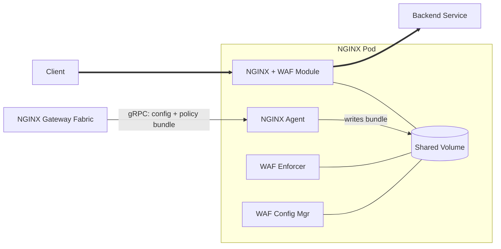

F5 NGINX Gateway Fabric integrates with F5 WAF for NGINX to provide enterprise-grade web application firewall protection. WAF policies are compiled externally and deployed to the data plane via the `WAFPolicy` custom resource.

 F5 WAF for NGINX requires NGINX Plus and a separate F5 WAF for NGINX subscription. Contact your F5 sales representative for licensing details. 

---

## Architecture

F5 WAF for NGINX uses a multi-container architecture. When WAF is enabled, each NGINX Pod is extended with two sidecar containers:

- **waf-enforcer**: Enforces WAF policies on incoming traffic.
- **waf-config-mgr**: Manages WAF configuration and distributes policy bundles to the enforcer.

Shared ephemeral volumes connect these containers to the main NGINX container.



---

## Enable WAF on the NginxProxy

WAF is enabled by setting `waf.enable: true` on an `NginxProxy` resource. This instructs NGINX Gateway Fabric to deploy the WAF sidecar containers alongside the NGINX Pod.

You can enable WAF at two levels:

- **Per Gateway** — Create an `NginxProxy` and reference it from a Gateway's `spec.infrastructure.parametersRef`. Only that Gateway gets WAF sidecars.
- **All Gateways** — Set WAF on the GatewayClass-level `NginxProxy` so that every Gateway managed by this NGINX Gateway Fabric instance gets WAF sidecars by default. A per-Gateway `NginxProxy` can override this (for example, to disable WAF on a specific Gateway).

For details on how GatewayClass and Gateway-level NginxProxy settings are merged, see [Data plane configuration]().

### Enable WAF per Gateway

Create an `NginxProxy` and reference it from your Gateway:

```yaml
apiVersion: gateway.nginx.org/v1alpha2
kind: NginxProxy
metadata:
  name: waf-enabled-proxy
spec:
  waf:
    enable: true
```

```yaml
apiVersion: gateway.networking.k8s.io/v1
kind: Gateway
metadata:
  name: gateway
spec:
  gatewayClassName: nginx
  infrastructure:
    parametersRef:
      name: waf-enabled-proxy
      group: gateway.nginx.org
      kind: NginxProxy
  listeners:
  - name: http
    port: 80
    protocol: HTTP
```

### Enable WAF for all Gateways

To enable WAF globally, set `nginx.config.waf.enable` in your Helm values. This configures the GatewayClass-level `NginxProxy` that is created automatically at install time:

```yaml
# values.yaml
nginx:
  config:
    waf:
      enable: true
```

```shell
helm upgrade --install ngf oci://ghcr.io/nginx/charts/nginx-gateway-fabric \
  --namespace nginx-gateway --create-namespace \
  -f values.yaml
```

Every Gateway attached to this GatewayClass will have WAF sidecars deployed. To disable WAF for a specific Gateway, create a per-Gateway `NginxProxy` with `waf.enable: false` and reference it from that Gateway.

 For additional WAF-related NginxProxy settings — including `disableCookieSeed`, `bundleFailOpen`, and custom WAF container images — see [Configure WAF settings](). 

---

## Policy lifecycle

### Bundles

A WAF bundle is a compiled policy package produced by the [F5 WAF for NGINX compiler](). It contains the security policy, optional logging profile, [attack signatures](), [threat campaign]() data, [bot signatures](), and related metadata in a format that the WAF engine can load and enforce at runtime. Pre-compiling policies into bundles enables faster, more reliable WAF startup — policies are resolved and validated at build time rather than on the running data plane.

### Compilation

WAF policies must be compiled before they can be applied. Compilation takes a JSON policy definition (and optionally [global settings]() such as a cookie seed and [user-defined signatures]()) and produces a `.tgz` bundle. NGINX Gateway Fabric does not compile policies — its role begins at fetching a compiled bundle and deploying it to the data plane.

### Source types

The following policy source types are supported, selected via the `spec.type` field on the `WAFPolicy` resource:

| Type   | Description                                                            |
|--------|------------------------------------------------------------------------|
| `NIM`  | NGINX Instance Manager — fetched by policy name or UID via NIM API     |
| `N1C`  | F5 NGINX One Console — fetched by policy name or object ID via N1C API |
| `HTTP` | Direct HTTP/HTTPS URL to a compiled bundle file                        |

For details on configuring each source type, see [Configure policy sources]().

---

## Policy attachment

`WAFPolicy` uses **inherited policy attachment**, following the [Gateway API policy attachment model](https://gateway-api.sigs.k8s.io/reference/policy-attachment/):

- A **Gateway-level** `WAFPolicy` protects all HTTPRoutes and GRPCRoutes attached to that Gateway automatically. New routes inherit protection without any additional configuration.
- A **Route-level** `WAFPolicy` can be applied to a specific HTTPRoute or GRPCRoute to override the Gateway-level policy for that route.
- More specific (route-level) policies take precedence over less specific (gateway-level) policies. The route-level policy completely replaces the gateway-level policy for that route — there is no merging.
- Only one `WAFPolicy` may target a given resource at a given level. If two policies target the same Gateway or Route, the second is rejected with `Accepted=False` and reason `Conflicted`.

```text
Gateway-level WAFPolicy → HTTPRoute (inherited automatically)

Route-level WAFPolicy   → Overrides Gateway-level for that route only
```

 GRPCRoutes are protected in the same way as HTTPRoutes. To target a GRPCRoute, set `kind: GRPCRoute` in the `targetRefs` field. Built-in gRPC log profiles (`log_grpc_all`, `log_grpc_blocked`, `log_grpc_illegal`) are available for gRPC-specific security logging. 

---

## See also

- [Get started with F5 WAF for NGINX]()
- [Configure policy sources (NIM, N1C, and HTTP)]()
- [Configure WAF settings]()
- [WAFPolicy and NginxProxy API reference]()
- [F5 WAF for NGINX documentation]()
