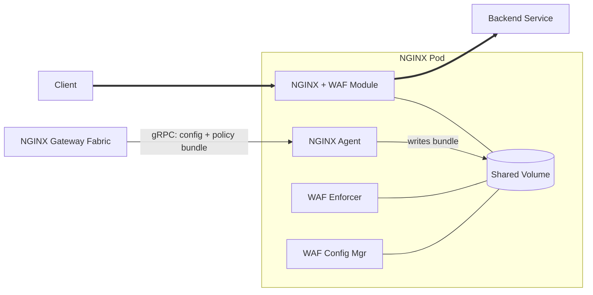

F5 NGINX Gateway Fabric integrates with F5 WAF for NGINX to provide enterprise-grade web application firewall protection. WAF policies are compiled externally and deployed to the data plane via the `WAFPolicy` custom resource.

 F5 WAF for NGINX requires NGINX Plus and a separate F5 WAF for NGINX subscription. Contact your F5 sales representative for licensing details. 

---

## Architecture

F5 WAF for NGINX uses a multi-container architecture. When WAF is enabled on a Gateway, each NGINX Pod is extended with two sidecar containers:

- **waf-enforcer**: Enforces WAF policies on incoming traffic.
- **waf-config-mgr**: Manages WAF configuration and distributes policy bundles to the enforcer.

Shared ephemeral volumes connect these containers to the main NGINX container.



---

## Policy lifecycle

WAF policies must be **compiled** before they can be applied. Compilation produces a `.tgz` bundle file from a JSON policy definition. The role of NGINX Gateway Fabric begins at fetching the compiled bundle — it does not compile policies.

The following policy source types are supported, selected via the `spec.type` field on the `WAFPolicy` resource:

| Type   | Description                                                            |
|--------|------------------------------------------------------------------------|
| `NIM`  | NGINX Instance Manager — fetched by policy name or UID via NIM API     |
| `N1C`  | F5 NGINX One Console — fetched by policy name or object ID via N1C API |
| `HTTP` | Direct HTTP/HTTPS URL to a compiled bundle file                        |

---

## Policy attachment

`WAFPolicy` uses **inherited policy attachment**, following the [Gateway API policy attachment model](https://gateway-api.sigs.k8s.io/reference/policy-attachment/):

- A **Gateway-level** `WAFPolicy` protects all HTTPRoutes and GRPCRoutes attached to that Gateway automatically. New routes inherit protection without any additional configuration.
- A **Route-level** `WAFPolicy` can be applied to a specific HTTPRoute or GRPCRoute to override the Gateway-level policy for that route.
- More specific (route-level) policies take precedence over less specific (gateway-level) policies.

 GRPCRoutes are protected in the same way as HTTPRoutes. To target a GRPCRoute, set `kind: GRPCRoute` in the `targetRefs` field. Built-in gRPC log profiles (`log_grpc_all`, `log_grpc_blocked`, `log_grpc_illegal`) are available for gRPC-specific security logging. 

---

## Policy inheritance and override

WAF protection follows a hierarchical model:

```
Gateway-level WAFPolicy → HTTPRoute (inherited automatically)
                        → GRPCRoute (inherited automatically)

Route-level WAFPolicy   → Overrides Gateway-level for that route only
```

Only one `WAFPolicy` may target a given resource at a given level. If two policies target the same Gateway or Route, the second is rejected with `Accepted=False` and reason `Conflicted`.

To apply a strict policy on a sensitive route while using a permissive base policy elsewhere, attach a route-level `WAFPolicy` to the specific HTTPRoute. The route-level policy completely replaces the gateway-level policy for that route — there is no merging.

---

## See also

- [Get started with F5 WAF for NGINX]()
- [Configure policy sources (NIM and N1C)]()
- [Configure WAF settings]()
- [WAFPolicy and NginxProxy API reference]()
- [F5 WAF for NGINX documentation]()
