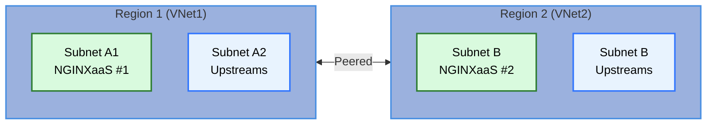

This guide describes how to configure disaster recovery (DR) for F5 NGINX as a Service for Azure deployments in separate (ideally [paired](https://learn.microsoft.com/en-us/azure/reliability/regions-paired)) Azure regions, ensuring upstream access remains available even if a region fails. The deployment architecture ensures users can access backend application servers (upstreams) continuously from an alternative region if the primary region becomes unavailable. The solution leverages Terraform, Azure Virtual Network (VNet) peering, and unique subnets to support failover.

---

**Architecture Overview**



- Each region has its own VNet, subnet, and NGINXaaS for Azure deployment.
- Cross region connectivity ensures that upstreams are reachable from either deployment. We use VNet peering in this guide to establish that connectivity.
- Upstreams (for example, VMs) are accessible from either NGINX deployment.

---

## Prerequisites

- Two Azure regions selected for DR.
- Unique, non-overlapping VNet and subnet address spaces for each region.
- Terraform 1.3+ and AzureRM provider 4.23+.

> **Note**: Each NGINX deployment **must run on separate subnets and non-overlapping address spaces**. This is critical for [Virtual Network (VNet) peering](https://learn.microsoft.com/en-us/azure/virtual-network/how-to-configure-subnet-peering) between the two regions. For example:
>
>  - Region 1 (Primary Deployment's Virtual Network Address Space): `10.0.0.0/16`
>  - Region 2 (Secondary Deployment's Virtual Network Address Space): `172.16.0.0/16`

---

## Configure disaster recovery 

### Step 1: Deploy prerequisite infrastructure

Each region requires its own resource group, VNet, subnet, public IP, network security group, and user-assigned identity. Example allocation in the prerequisites module:

```hcl
# Region 1
resource "azurerm_virtual_network" "deployment_primary_vnet" {
  address_space = ["10.0.0.0/16"]
  # other config...
}

resource "azurerm_subnet" "deployment_primary_subnet" {
  address_prefixes = [cidrsubnet("10.0.0.0/16", 8, 0)] # results in 10.0.0.0/24
}


# Region 2
resource "azurerm_virtual_network" "deployment_secondary_vnet" {
  address_space = ["172.16.0.0/16"]
}

resource "azurerm_subnet" "deployment_secondary_subnet" {
  address_prefixes = [cidrsubnet("172.16.0.0/16", 8, 0)] # results in 172.16.0.0/24
}
```
---

### Step 2: Deploy NGINXaaS for Azure in each region

```hcl
resource "azurerm_nginx_deployment" "deployment_primary_nginxaas" {
  name                = var.name_primary
  resource_group_name = var.resource_group_primary
  location            = var.location_primary
  ...
  network_interface {
    subnet_id = azurerm_subnet.deployment_primary_subnet.id
  }
}

resource "azurerm_nginx_deployment" "deployment_secondary_nginxaas" {
  name                = var.name_secondary
  resource_group_name = var.resource_group_secondary
  location            = var.location_secondary
  ...
  network_interface {
    subnet_id = azurerm_subnet.deployment_secondary_subnet.id
  }
}
```


---

### Step 3: Peer the VNets

```hcl
resource "azurerm_virtual_network_peering" "vnet_primary_to_vnet_secondary" {
  name                      = "peering-vnet-primary-to-vnet-secondary"
  resource_group_name       = var.resource_group_primary
  virtual_network_name      = azurerm_virtual_network.deployment_primary_vnet.name
  remote_virtual_network_id = azurerm_virtual_network.deployment_secondary_vnet.id
}

resource "azurerm_virtual_network_peering" "vnet_secondary_to_vnet_primary" {
  name                      = "peering-vnet-secondary-to-vnet-primary"
  resource_group_name       = var.resource_group_secondary
  virtual_network_name      = azurerm_virtual_network.deployment_secondary_vnet.name
  remote_virtual_network_id = azurerm_virtual_network.deployment_primary_vnet.id
}
```


---

### Step 4: Configure upstreams

Deploy upstream VMs in a subnet separate from the NGINXaaS deployment subnet in the **primary region**. Example:

```hcl
resource "azurerm_subnet" "upstreams" {
  name                 = "upstreams-subnet"
  resource_group_name  = var.resource_group_primary
  virtual_network_name = azurerm_virtual_network.deployment_primary_vnet.name
  address_prefixes     = [cidrsubnet(var.vnet_addr_space, 8, 1)]
}
```


---

## Step 5: NGINXaaS Configuration for Failover

Configure both NGINXaaS deployments to include upstreams from the primary region in their corresponding NGINX configuration. Example `nginx.conf` snippet:

```nginx
upstream backend {
    server <vm1-private-ip>:80;
    server <vm2-private-ip>:80;
}
```

- Use private IPs reachable via VNet peering.
- Health checks can be configured to detect regional failures and reroute traffic.

---

### Step 6: DNS and failover

- Use Azure Traffic Manager or an external DNS solution to direct traffic to the healthy NGINX deployment.
- In case of a regional outage, update DNS record to point to the public IP of the NGINXaas deployment in the secondary region.

---

## Workarounds for Subnet Peering Caveats

- **Subnet Peering for Overlapping VNets:**
If overlapping address spaces are unavoidable, use subnet-level peering to selectively peer only the required subnets.

```shell
az network vnet peering create \
  --name vnet1-to-vnet2 \
  --resource-group <rg1> \
  --vnet-name <vnet1> \
  --remote-vnet <vnet2-id> \
  --allow-vnet-access \
  --peer-complete-vnet false \
  --local-subnet-names <subnet1> \
  --remote-subnet-names <subnet2>
```
> **Note**: As of May 2025, subnet peering is not available by default for all subscriptions. To use this feature, you must have the subscription on which you want to configure subnet peering be registered with Azure. Please review the configuration details and limitations in this [document](https://learn.microsoft.com/en-us/azure/virtual-network/how-to-configure-subnet-peering).

---

## Failover Process

1. **Monitor**: Continuously monitor NGINXaaS deployment health in both regions.
1. **Failover**: If a region fails, update DNS or Traffic Manager to route traffic to the surviving region's NGINXaaS deployment.
1. **Recovery**: Restore the failed region and verify peering and upstream connectivity before re-enabling traffic.

---

## Diagram

```mermaid
flowchart LR

    subgraph Region1[Region 1]
        direction TB
        NGINX1[NGINXaaS Deployment 1]
        VM1["Upstreams (VMs)"]
    end

    subgraph Region2[Region 2]
        direction TB
        NGINX2[NGINXaaS Deployment 2]
    end

    Users["웃 Users/Clients<br/>&#40;using DNS/traffic manager&#41;"]

    Region2 <-->|Peering| Region1
    NGINX1 --> Users
    NGINX2 --> Users

    %% Styling
    style Region1 fill:#9bb1de,stroke:#4a90e2,stroke-width:2px
    style Region2 fill:#9bb1de,stroke:#4a90e2,stroke-width:2px
    style NGINX1 fill:#d9fade,stroke:#2e7d32,stroke-width:2px,color:#000
    style NGINX2 fill:#d9fade,stroke:#2e7d32,stroke-width:2px,color:#000
    style VM1 fill:#e8f3fe,stroke:#3075ff,stroke-width:2px,color:#000
    style Users fill:#faefd9,stroke:orange,color:orange,stroke-width:2px
    
    accDescr: Diagram showing Region 1 on the left and Region 2 on the right. Region 1 contains "NGINXaaS Deployment 1" and "Upstreams (VMs)". Region 2 contains "NGINXaaS Deployment 2". A directional arrow labeled "Peering" points from Region 1 to Region 2. Both NGINXaaS deployments have arrows pointing to a box labeled "Users/Clients (using DNS/traffic manager)", indicating user traffic flows from both regions.
```




---

## Summary

By deploying NGINXaaS in separate regions with unique subnets and peered VNets, and configuring upstreams and DNS for failover, this topology ensures high availability and DR for your applications. Use subnet peering if address spaces overlap. Lastly, always monitor and test your failover paths.
