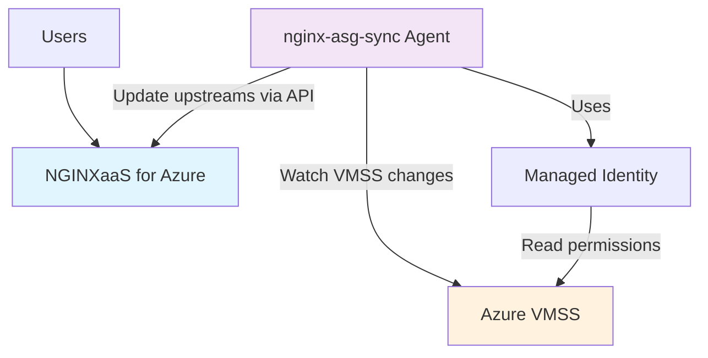

## Overview

F5 NGINXaaS for Azure provides seamless integration with Azure Virtual Machine Scale Sets (VMSS) through dynamic upstream management. This feature enables automatic scaling of your application backend without requiring manual NGINX configuration updates when VMSS instances are added or removed.

With VMSS backend integration, you can:

- Automatically sync VMSS instance IP addresses to NGINX upstreams
- Scale VMSS instances out and in without NGINX configuration changes

## Architecture



The nginx-asg-sync agent monitors your VMSS for scaling events and automatically updates the NGINXaaS upstream configuration via the dataplane API. This ensures that traffic is distributed to all healthy instances without manual intervention.

## Prerequisites

Before setting up VMSS backend integration, ensure you have:

- An active NGINXaaS for Azure deployment
- Azure Virtual Machine Scale Sets (VMSS)
- Network connectivity between NGINXaaS and VMSS instances
- An Azure VM or container to run the nginx-asg-sync agent
- Appropriate Azure permissions to assign managed identities

## Getting Started

### Step 1: Create NGINXaaS deployment with dynamic upstreams

Create an NGINXaaS deployment. See the [documentation]() to deploy via the Azure portal. Then, 
create an NGINX configuration with dynamic upstreams that will be managed by the nginx-asg-sync agent. The upstream must meet these requirements:

- The upstream cannot have any static servers defined via the `server` directive
- The upstream must have a shared memory [zone](https://nginx.org/en/docs/http/ngx_http_upstream_module.html#zone) defined
- The upstream must have a [state](https://nginx.org/en/docs/http/ngx_http_upstream_module.html#state) file declared

Example NGINX configuration:

```nginx
http{
    upstream backend-one {
        zone backend-one 64k;
        state /opt/nginx/state/backend-one.conf;
    }

    upstream backend-two {
        zone backend-two 64k;
        state /opt/nginx/state/backend-two.conf;
    }

    server {
        listen 80;

        status_zone backend;

        location /backend-one {
            proxy_set_header Host $host;
            proxy_pass http://backend-one;
        }

        location @hc-backend-one {
            internal;
            proxy_connect_timeout 1s;
            proxy_read_timeout 1s;
            proxy_send_timeout 1s;

            proxy_pass http://backend-one;
            health_check interval=1s mandatory;
        }

        location /backend-two {
            proxy_set_header Host $host;
            proxy_pass http://backend-two;
        }

        location @hc-backend-two {
            internal;
            proxy_connect_timeout 1s;
            proxy_read_timeout 1s;
            proxy_send_timeout 1s;

            proxy_pass http://backend-two;
            health_check interval=1s mandatory;
        }
    }
}
```


**Health Checks Recommendation**: It is strongly recommended to add active health checks for your upstreams using VMSS backend. This will prevent traffic from being routed to an unready VMSS instance and ensure better reliability during scaling operations.


[Apply this NGINX configuration]() to your NGINXaaS deployment.

### Step 2: Create Virtual Machine Scale Sets and ensure network connectivity

Create your Azure Virtual Machine Scale Sets that will serve as backend servers for your applications.

#### Create VMSS

Create Virtual Machine Scale Sets for your application backends. You can create VMSS using:

- **Azure Portal**: Navigate to **Virtual machine scale sets** in the Azure portal and follow the creation wizard
- **Azure CLI**: Use the `az vmss create` command with appropriate parameters for your requirements

For detailed instructions on creating VMSS, see the [Azure documentation](https://learn.microsoft.com/en-us/azure/virtual-machine-scale-sets/flexible-virtual-machine-scale-sets-portal).

- Ensure network connectivity between the subnet delegated to the NGINXaaS deployment and vmss. For example, the vmss and NGINXaaS deployment can run on the same Azure VNET or on peered VNETs.

- Install and run your applications on the vmss.

### Step 3: Create NGINXaaS dataplane API key

Create a dataplane API key that the nginx-asg-sync agent will use to authenticate with your NGINXaaS deployment.


The data plane API key has the following requirements:

- The key should have an expiration date. The default expiration date is six months from the date of creation. The expiration date cannot be longer than two years from the date of creation.
- The key should be at least 12 characters long.
- The key requires three out of four of the following types of characters:
  - lowercase characters.
  - uppercase characters.
  - symbols.
  - numbers.

A good example of an API key that will satisfy the requirements is UUIDv4.


The data plane API key can be created using the Azure CLI or portal.

#### Create an NGINXaaS data plane API key using the Azure portal

1. Go to your NGINXaaS for Azure deployment.
2. Select **NGINXaaS Loadbalancer for Kubernetes** on the left blade.
3. Select **New API Key**.
4. Provide a name for the new API key in the right panel, and select an expiration date.
5. Select the **Add API Key** button.
6. Copy the value of the new API key.


Make sure to write down the key value in a safe location after creation, as you cannot retrieve it again. If you lose the generated value, delete the existing key and create a new one.


#### Create an NGINXaaS data plane API key using the Azure CLI

Set shell variables about the name of the NGINXaaS you've already created:

```bash
## Customize this to provide the details about my already created NGINXaaS deployment
nginxName=myNginx
nginxGroup=myNginxGroup
```

Generate a new random data plane API key:

```bash
# Generate a new random key or specify a value for it.
keyName=myKey
keyValue=$(uuidgen --random)
```

Create the key for your NGINXaaS deployment:

```bash
az nginx deployment api-key create --name $keyName --secret-text $keyValue --deployment-name $nginxName --resource-group $nginxGroup
az nginx deployment api-key create --name $keyName --secret-text $keyValue --deployment-name $nginxName --resource-group $nginxGroup
```

#### NGINXaaS data plane API endpoint

The data plane API endpoint can be retrieved using the Azure CLI or portal.

##### View NGINXaaS data plane API endpoint using the Azure portal

1. Go to your NGINXaaS for Azure deployment.
2. Select **NGINXaaS Loadbalancer for Kubernetes** on the left blade.
3. The data plane API endpoint associated with the deployment is available at the top of the screen.

##### View NGINXaaS data plane API endpoint using the Azure CLI

```bash
dataplaneAPIEndpoint=$(az nginx deployment show -g "$nginxGroup" -n "$nginxName" --query properties.dataplaneApiEndpoint -o tsv)
dataplaneAPIEndpoint=$(az nginx deployment show -g "$nginxGroup" -n "$nginxName" --query properties.dataplaneApiEndpoint -o tsv)
```

### Step 4: Install nginx-asg-sync agent

The nginx-asg-sync agent can be installed on an Azure VM or run as a container. Download and install the agent before configuring managed identity permissions.

#### Option A: Install on Azure VM

Create or use an existing Azure VM for the nginx-asg-sync agent. You can create a VM using:

- **Azure Portal**: Navigate to **Virtual machines** in the Azure portal and follow the creation wizard
- **Azure CLI**: Use the `az vm create` command with appropriate parameters for your requirements

For detailed instructions on creating VMs, see the [Azure documentation](https://learn.microsoft.com/en-us/azure/virtual-machines/linux/quick-create-portal).

Sample Azure CLI command to create a VM:

```bash
# Create a VM for nginx-asg-sync agent (optional if you already have one)
vmName="sync-agent-vm"
vmResourceGroup="myResourceGroup"

az vm create \
  --resource-group $vmResourceGroup \
  --name $vmName \
  --image Ubuntu2204 \
  --admin-username azureuser \
  --generate-ssh-keys \
  --size Standard_B1s
```

Install nginx-asg-sync agent on the VM:

```bash
# SSH into the VM and install
# Get latest version and detect architecture
VERSION=$(curl -sL https://api.github.com/repos/nginx/nginx-asg-sync/releases/latest | grep tag_name | cut -d '"' -f 4 | sed 's/^v//')
if [ -z "$VERSION" ]; then
    echo "Failed to fetch latest version, using fallback version 1.0.2"
    VERSION="1.0.2"
fi
BASE_URL="https://github.com/nginxinc/nginx-asg-sync/releases/download/v${VERSION}"

ARCH=$(uname -m)
case "$ARCH" in
  x86_64) ARCH="amd64" ;;
  aarch64) ARCH="arm64" ;;
  *) echo "Unsupported architecture" && exit 1 ;;
esac

# Download and install nginx-asg-sync
curl -LO "${BASE_URL}/nginx-asg-sync_${VERSION}_linux_${ARCH}.tar.gz"
tar -xzf "nginx-asg-sync_${VERSION}_linux_${ARCH}.tar.gz"
chmod +x nginx-asg-sync
sudo mv nginx-asg-sync /usr/local/bin/

# Verify installation
ls -la /usr/local/bin/nginx-asg-sync

# Create configuration directory
sudo mkdir -p /etc/nginx/
```

#### Option B: Run as Container

Deploy nginx-asg-sync as a container using Docker:

```bash
# Pull the Docker image
docker pull docker.io/nginx/nginx-asg-sync:v1.0.1-79-g950b8bc-dirty

# Create the configuration file (config.yaml) in your current directory
# (See Step 6 for the complete configuration file content)

# Run nginx-asg-sync container
docker run --rm -it \
  -v $(pwd)/config.yaml:/etc/nginx/config.yaml \
  -e CONFIG_PATH=/etc/nginx/config.yaml \
  docker.io/nginx/nginx-asg-sync:v1.0.1-79-g950b8bc-dirty
```

Example output when the container starts successfully:

```
2025/12/31 10:25:30 nginx-asg-sync version v1.0.1-79-g950b8bc-dirty
```

### Step 5: Assign managed identity permissions

nginx-asg-sync uses the Azure API to get the list of IP addresses of the instances of a Virtual Machine Scale Set. To access the Azure API, nginx-asg-sync must have credentials. This section configures a system-assigned managed identity with the minimum required permissions.

You can assign managed identity permissions using:

- **Azure Portal**: Navigate to **Resource** → **Identity** → **Role assignments** in the Azure portal
- **Azure CLI**: Use Azure CLI commands for programmatic assignment

For detailed instructions on managed identities, see the [Azure documentation](https://learn.microsoft.com/en-us/azure/active-directory/managed-identities-azure-resources/overview).

The following steps show the Azure CLI approach:

#### Step 1: Enable System Assigned Managed Identity on the VM

Enable system-assigned managed identity on your nginx-asg-sync VM:

```bash
# Set variables
vmName="sync-agent-vm"
vmResourceGroup="myResourceGroup"
vmssResourceGroup="myVmssResourceGroup"
vmssName="backend-one-vmss"
subscriptionId=$(az account show --query id --output tsv)

# Enable system-assigned managed identity on VM
az vm identity assign \
  --resource-group $vmResourceGroup \
  --name $vmName
```

#### Step 2: Get the VM's Managed Identity Principal ID

Retrieve the principal ID of the VM's system-assigned managed identity:

```bash
# Get the identity's principal ID
principalId=$(az vm show \
  --resource-group $vmResourceGroup \
  --name $vmName \
  --query identity.principalId \
  --output tsv)
```

#### Step 3: Create the Custom Role

Create a custom role with only the necessary permissions for nginx-asg-sync:

Create a file called `vmss-network-read-role.json`:

```json
{
  "Name": "VMSS-Network-Read-Role",
  "Description": "Read VMSS and VMSS network interface information",
  "Actions": [
    "Microsoft.Compute/virtualMachineScaleSets/read",
    "Microsoft.Compute/virtualMachineScaleSets/networkInterfaces/read"
  ],
  "NotActions": [],
  "AssignableScopes": [
    "/subscriptions/<SUBSCRIPTION_ID>"
  ]
}
```

```bash
# Set role name
roleName="VMSS-Network-Read-Role"

# Replace subscription ID in the JSON file (if using the template above)

# Create the custom role
az role definition create \
  --role-definition vmss-network-read-role.json
```

#### Step 4: Get the VMSS Resource ID (Scope)

Get the full resource ID of your VMSS to use as the scope for role assignment:

```bash
# Get VMSS resource ID
vmssId=$(az vmss show \
  --resource-group $vmssResourceGroup \
  --name $vmssName \
  --query id \
  --output tsv)
```

#### Step 5: Assign the Custom Role to the VM's Managed Identity

Assign the custom role to the VM's system-assigned managed identity:

```bash
# Assign the custom role to the VM's managed identity
az role assignment create \
  --assignee-object-id $principalId \
  --assignee-principal-type ServicePrincipal \
  --role $roleName \
  --scope $vmssId
```

#### Step 6: Verify Role Assignment

Verify that the role assignment was created successfully:

```bash
# Verify role assignment
az role assignment list \
  --assignee $principalId \
  --scope $vmssId \
  --output table
```


**Permission Propagation**: After creating the role assignment, it may take a few minutes for the permissions to take effect across Azure services.


### Step 6: Configure nginx-asg-sync agent

Create the configuration file for nginx-asg-sync to connect to your NGINXaaS deployment and monitor VMSS instances.

nginx-asg-sync is configured in **/etc/nginx/config.yaml**.

#### Configuration file

Create `/etc/nginx/config.yaml`:

```yaml
# nginx-asg-sync configuration for NGINXaaS for Azure
cloud_provider: Azure
subscription_id: your_subscription_id
resource_group_name: your_vmss_resource_group

# NGINXaaS dataplane API endpoint (note the /nplus suffix)
api_endpoint: https://your-nginxaas-endpoint.region.nginxaas.net/nplus
sync_interval: 5s

# Authentication headers for NGINXaaS
custom_headers:
  Content-Type: application/json
  Authorization: ApiKey your_base64_encoded_dataplane_api_key

# VMSS upstreams configuration
upstreams:
  - name: backend-one
    virtual_machine_scale_set: backend-one-vmss
    port: 80
    kind: http
    max_conns: 0
    max_fails: 1
    fail_timeout: 10s
    slow_start: 0s
    
  - name: backend-two  
    virtual_machine_scale_set: backend-two-vmss
    port: 8080
    kind: http
    max_conns: 100
    max_fails: 3
    fail_timeout: 30s
    slow_start: 10s
```

#### Configuration parameters



| Parameter | Description | Required |
|-----------|-------------|----------|
| `cloud_provider` | Must be set to "Azure" | Yes |
| `subscription_id` | Azure subscription ID containing the VMSS | Yes |
| `resource_group_name` | Resource group name containing the VMSS | Yes |
| `api_endpoint` | NGINXaaS dataplane API endpoint with `/nplus` suffix | Yes |
| `sync_interval` | How often to check for VMSS changes | No (default: 5s) |
| `custom_headers` | Authentication headers for NGINXaaS API | Yes |
| `upstreams[].name` | Name of the NGINX upstream to manage | Yes |
| `upstreams[].virtual_machine_scale_set` | Name of the VMSS to monitor | Yes |
| `upstreams[].port` | Port number on VMSS instances | Yes |
| `upstreams[].kind` | Traffic type: "http" or "stream" | Yes |
| `upstreams[].max_conns` | Maximum connections per instance | No (default: 0) |
| `upstreams[].max_fails` | Failed attempts before marking unhealthy | No (default: 1) |
| `upstreams[].fail_timeout` | Time to consider instance failed | No (default: 10s) |
| `upstreams[].slow_start` | Gradual weight increase time | No (default: 0s) |


#### Start the agent

Start nginx-asg-sync directly using the command line:

```bash
# Run nginx-asg-sync directly
nginx-asg-sync config_path=/etc/nginx/config.yaml

# Run with log file output
nginx-asg-sync config_path=/etc/nginx/config.yaml -log_path=< path to log file >
```

Example output when the agent starts successfully:

```
2026/01/08 15:44:12 nginx-asg-sync version 1.0.2
2026/01/08 15:44:13 Updated HTTP servers of backend-one for group naveen-vmss-latest ; Added: [172.19.0.6:80 172.19.0.7:80], Removed: [], Updated: []

2026/01/08 16:08:07 Updated HTTP servers of backend-one for group naveen-vmss-latest ; Added: [172.19.0.8:80], Removed: [], Updated: []


```

## Monitoring and Troubleshooting

### Verify upstream updates

Check that upstreams are being updated in NGINXaaS:

1. **Using NGINXaaS API Dashboard:**
   - Navigate to your NGINXaaS deployment in Azure portal
   - Go to **Monitoring** → **Metrics**
   - Monitor the following metrics for upstream health:
     - `plus.http.upstream.peers.state.up` – shows if the peer reports being healthy
     - `plus.http.upstream.peers.request.count` – shows which peers are handling requests

2. **Using dataplane API:**

   ```bash
   # Check upstream status via dataplane API
   curl -H "Authorization: ApiKey <base64_encoded_dataplane_api_key>" \
        -H "Content-Type: application/json" \
        "<dataplane_endpoint>/nplus/9/http/upstreams/<upstream_name>/servers"
   ```

   Example output showing VMSS instances synchronized to the upstream:

   ```json
   [
     {
       "max_conns": 0,
       "max_fails": 1,
       "server": "172.19.0.8:80",
       "fail_timeout": "10s",
       "slow_start": "0s",
       "id": 2115793169
     },
     {
       "max_conns": 0,
       "max_fails": 1,
       "server": "172.19.0.6:80",
       "fail_timeout": "10s",
       "slow_start": "0s",
       "id": 528011112
     },
     {
       "max_conns": 0,
       "max_fails": 1,
       "server": "172.19.0.7:80",
       "fail_timeout": "10s",
       "slow_start": "0s",
       "id": 1665424715
     }
   ]
   ```

### Common troubleshooting steps

1. **Agent can't authenticate with NGINXaaS:**
   - Verify the API key is correctly base64 encoded
   - Check that the API key hasn't expired
   - Ensure the dataplane API endpoint URL is correct with `/nplus` suffix

2. **Agent can't read VMSS information:**
   - Verify managed identity is assigned to the VM/container
   - Check that appropriate permissions are granted to the identity
   - Confirm subscription ID and resource group names are correct

3. **Upstreams not updating:**
   - Verify upstream names in config.yaml match NGINX configuration
   - Check that upstreams are properly defined with zone and state
   - Monitor agent logs for error messages

## What's Next

- Learn about [NGINXaaS monitoring and metrics]()
- Explore [advanced load balancing configurations]()
